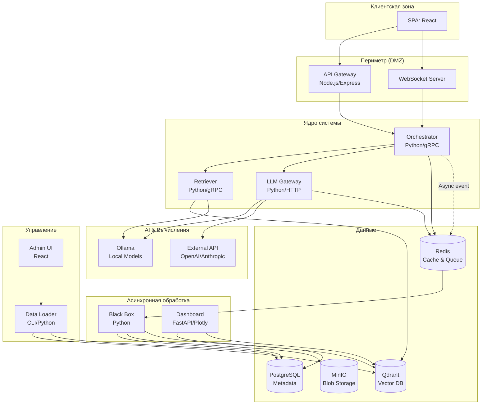
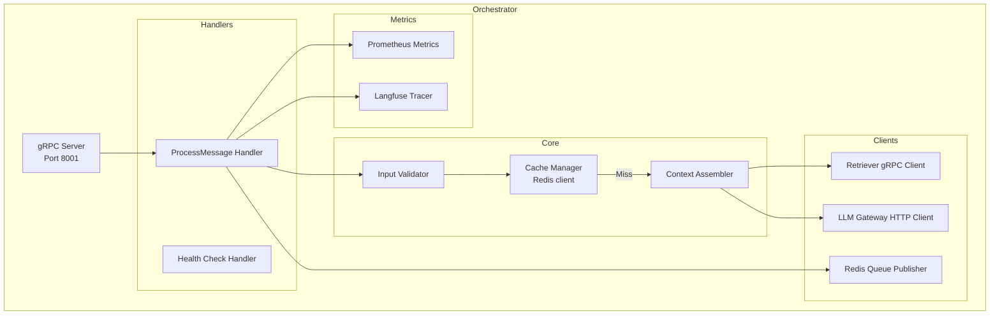
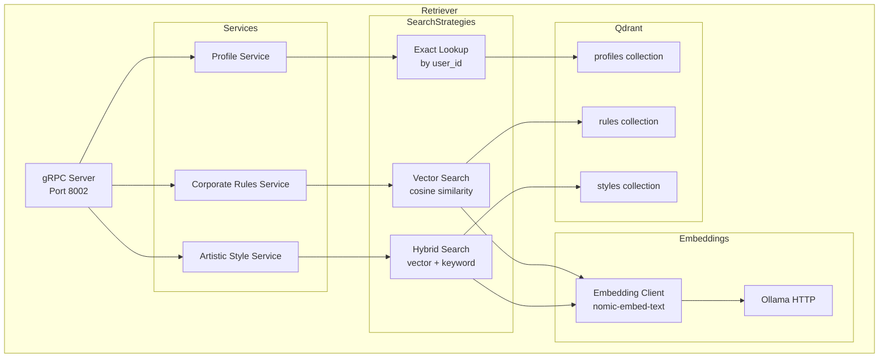
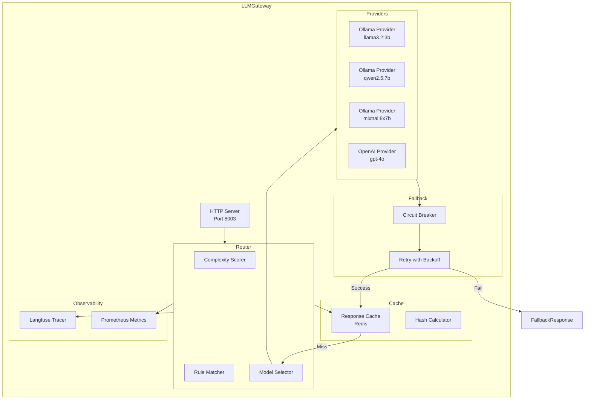
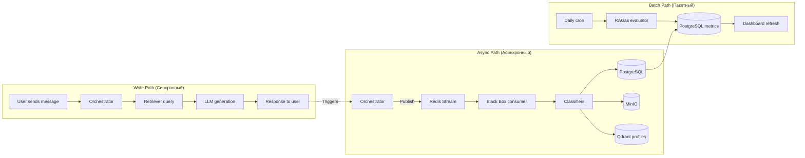
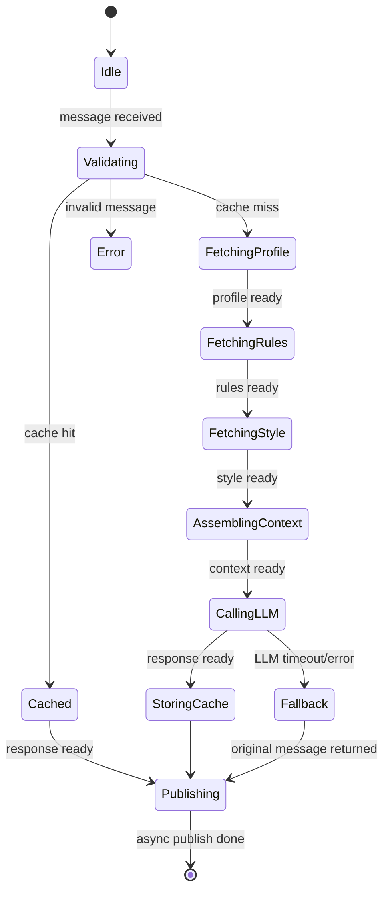
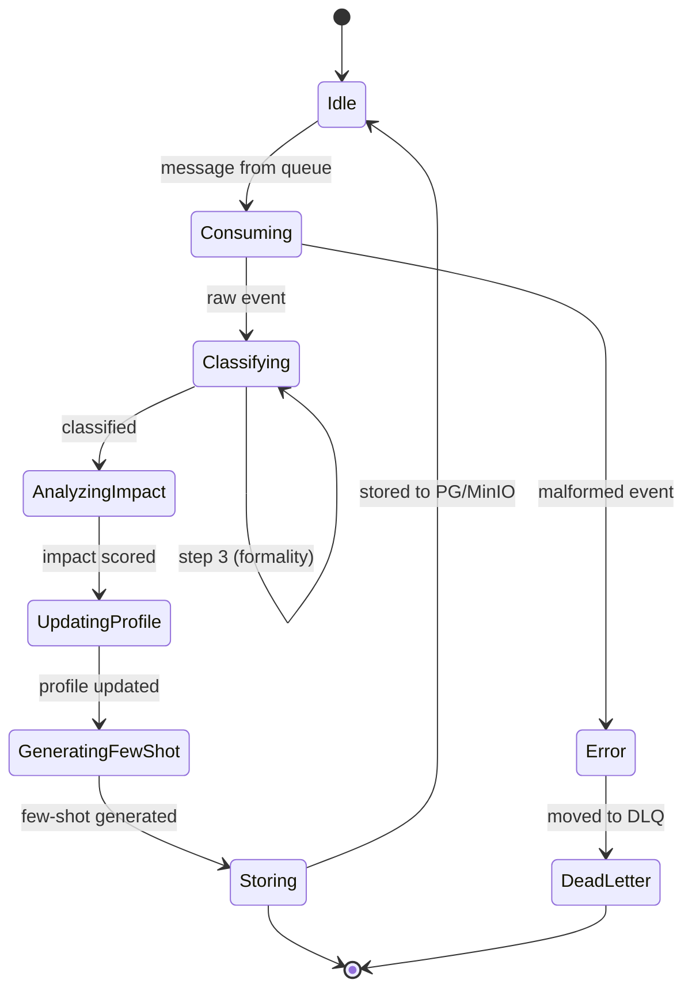
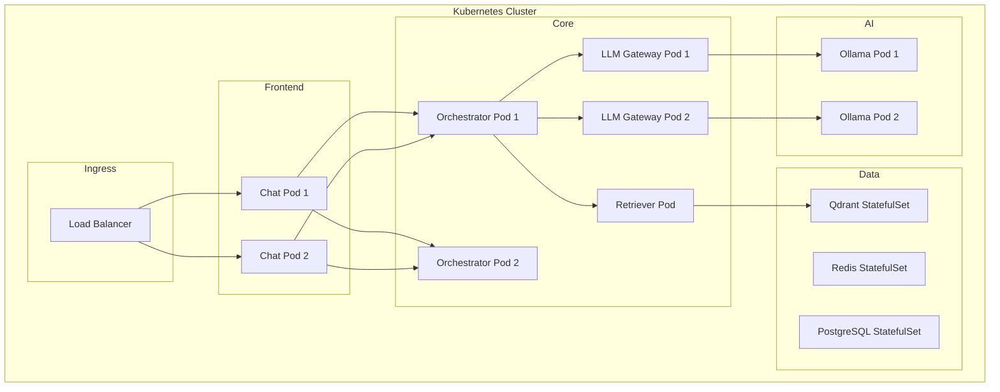

# System Architecture Document — Chameleon Chat

## Адаптивная коммуникационная система в реальном времени

---

## 1. Executive Summary (Краткий обзор)

**Chameleon Chat** — это система реального времени, которая автоматически адаптирует сообщения пользователей в соответствии с корпоративными правилами, профилем собеседника и выбранным литературным стилем. Сообщение, которое видит получатель, может существенно отличаться от того, что написал отправитель, при этом оригинал сохраняется только для аналитики.

**Ключевая инновация:** Система не просто фильтрует или цензурирует, а **трансформирует стиль и тон** сообщения, сохраняя исходный смысл и намерение.

**Архитектурный паттерн:** Микросервисная архитектура с синхронным (реалтайм) и асинхронным (аналитика) потоками обработки.

**Целевое развертывание:** Локальный Docker Compose для прототипа, с перспективой перехода в Kubernetes.

---

## 2. System Context (Контекст системы)

### 2.1. Диаграмма контекста C4

```mermaid
flowchart LR
    User[Пользователь\n(Отправитель)]
    Recipient[Пользователь\n(Получатель)]
    Admin[Администратор]
    Analyst[Аналитик\n(HR/Data Scientist)]
    
    subgraph System["Chameleon Chat System"]
        Chat[Чат-интерфейс]
    end
    
    User -->|Пишет сообщение| Chat
    Chat -->|Адаптированное сообщение| Recipient
    Admin -->|Управляет RAG данными| Chat
    Analyst -->|Смотрит дашборд| Chat
    
    subgraph External["Внешние системы"]
        HR[HR система] -.->|Импорт профилей| Chat
        Docs[Документы]\n(правила, книги) -->|Загрузка| Chat
    end
```

### 2.2. Границы системы

| Входит в систему | Не входит (внешнее) |
|------------------|---------------------|
| Адаптация текста через LLM | Аутентификация пользователей (stub) |
| RAG поиск правил и стилей | Хранение истории чатов (только аналитика) |
| Аналитика оригинальных сообщений | Интеграция с существующими мессенджерами |
| Администрирование RAG данных | Видео/аудио звонки |
| Дашборд метрик | Мобильные приложения (только web) |

---

## 3. Architectural Drivers (Архитектурные драйверы)

### 3.1. Функциональные требования

| ID | Требование | Приоритет |
|----|------------|-----------|
| FR-1 | Адаптировать сообщение за < 1 секунды (p95) | Критический |
| FR-2 | Поддерживать переключение между локальными LLM и API | Высокий |
| FR-3 | Хранить профили пользователей для персонализации | Высокий |
| FR-4 | Загружать корпоративные правила без перезапуска | Средний |
| FR-5 | Применять литературные стили (Чехов, Довлатов...) | Средний |
| FR-6 | Анализировать оригиналы для самообучения | Низкий (прототип) |
| FR-7 | Голосовой ввод/вывод (бонус) | Низкий |

### 3.2. Нефункциональные требования

| ID | Требование | Целевое значение |
|----|------------|------------------|
| NFR-1 | Латентность адаптации (p95) | ≤ 800 мс |
| NFR-2 | Доступность системы | 99.5% (прототип) |
| NFR-3 | Горизонтальное масштабирование | До 5 реплик Orchestrator |
| NFR-4 | Возможность замены LLM провайдера | Без изменения кода |
| NFR-5 | Логирование всех адаптаций | 100% сообщений |
| NFR-6 | Безопасность (прототип) | Базовая (JWT stub) |

### 3.3. Архитектурные решения

| Решение | Обоснование |
|---------|-------------|
| **Микросервисы вместо монолита** | Разные темпы изменений: чат (быстро), LLM (медленно), аналитика (пакетно) |
| **Синхронный + асинхронный потоки** | Адаптация не должна ждать аналитики |
| **Qdrant для всех RAG данных** | Унификация векторного хранилища, поддержка гибридного поиска |
| **Redis для кэша и очереди** | Один компонент на две задачи, малый overhead |
| **gRPC между сервисами** | В 10x быстрее REST, поддержка стримов для будущих voice-фич |
| **Docker Compose для прототипа** | Быстрый старт, повторяемость окружения |

---

## 4. Container Architecture (Архитектура контейнеров)

### 4.1. Диаграмма контейнеров C4



### 4.2. Описание контейнеров

| Контейнер | Технология | Порты | Реплики | Протокол |
|-----------|------------|-------|---------|----------|
| **Chat Frontend** | React + Node.js | 8080 (HTTP), 8081 (WS) | 1-2 | HTTP/WS |
| **API Gateway** | Express.js | 8000 | 2 | HTTP |
| **Orchestrator** | Python/FastAPI + gRPC | 8001 | 2 | gRPC |
| **Retriever** | Python/FastAPI + gRPC | 8002 | 1 | gRPC |
| **LLM Gateway** | Python/FastAPI | 8003 | 2 | HTTP |
| **Black Box** | Python | 8004 (internal) | 1 | gRPC |
| **Dashboard** | FastAPI + Plotly | 8200 | 1 | HTTP |
| **Admin UI** | React | 8100 | 1 | HTTP |
| **Data Loader** | Python CLI | - | - | CLI |
| **Qdrant** | v1.7.0 | 6333, 6334 | 1 | HTTP/gRPC |
| **Redis** | 7-alpine | 6379 | 1 | RESP |
| **PostgreSQL** | 15 | 5432 | 1 | PGWire |
| **MinIO** | latest | 9000, 9001 | 1 | S3 |
| **Ollama** | latest | 11434 | 1 | HTTP |

---

## 5. Component Architecture (Архитектура компонентов)

### 5.1. Component diagram — Orchestrator



### 5.2. Component diagram — Retriever



### 5.3. Component diagram — LLM Gateway



---

## 6. Data Architecture (Архитектура данных)

### 6.1. Схема данных (Domain Model)

```yaml
Domain Model:
  entities:
    Message:
      attributes:
        - message_id: UUID
        - sender_id: UUID
        - recipient_id: UUID
        - original_text: string (max 4000)
        - adapted_text: string
        - was_adapted: boolean
        - adaptation_metadata:
            - model_used: string
            - rules_applied: list[string]
            - style_used: optional[string]
            - processing_time_ms: integer
        - timestamp: datetime
        - channel_id: string
        
    UserProfile:
      attributes:
        - user_id: UUID (PK)
        - full_name: string
        - role: enum[employee, manager, director, hr, intern]
        - department: string
        - honorific_type: enum[first_name, first_last, patronymic, title]
        - communication_mode: enum[formal, informal, technical, diplomatic]
        - known_triggers: list[string]
        - adaptive_history_vector: list[float] (768 dims)
        - preferred_voice_id: optional[string]
        
    CorporateRule:
      attributes:
        - rule_id: UUID (PK)
        - category: enum[address, tone, content, timing]
        - priority: integer (1-10)
        - condition: string (who/when applies)
        - transformation: string (what to change)
        - example_original: string
        - example_adapted: string
        - role_from: string
        - role_to: string
        
    ArtisticStyle:
      attributes:
        - style_id: UUID (PK)
        - style_name: string (chekhov, dovlatov, pelevin...)
        - author: string
        - sample_text: string (500-1000 chars)
        - emotion_tags: list[string]
        - era: string
        
    AnalyticsEvent:
      attributes:
        - event_id: UUID
        - message_id: UUID
        - original_toxicity_score: float (0-1)
        - original_formality_score: float (1-10)
        - adaptation_effectiveness: float (0-1)
        - predicted_conflict_without_adaptation: float
        - actual_outcome: optional[enum[positive, neutral, negative]]
        - processed_at: datetime
```

### 6.2. Схема Qdrant коллекций

| Коллекция | Векторная размерность | Индекс | Поля фильтрации |
|-----------|----------------------|--------|-----------------|
| **user_profiles** | 768 | HNSW | `user_id` (keyword, уникальный), `role`, `department` |
| **corporate_rules** | 768 | HNSW | `role_from`, `role_to`, `category`, `priority` |
| **artistic_styles** | 768 | HNSW | `style_name`, `author`, `emotion_tags` |

### 6.3. Схема PostgreSQL (метаданные)

```sql
-- Аналитика и логи
CREATE TABLE messages_analytics (
    id UUID PRIMARY KEY,
    original_text_hash VARCHAR(64),
    original_toxicity FLOAT,
    original_sentiment VARCHAR(20),
    adaptation_effectiveness FLOAT,
    processing_latency_ms INT,
    model_used VARCHAR(50),
    created_at TIMESTAMP DEFAULT NOW()
);

-- Агрегированные метрики для дашборда
CREATE TABLE daily_metrics (
    date DATE PRIMARY KEY,
    total_messages INT,
    adaptations_count INT,
    avg_toxicity_decrease FLOAT,
    avg_formality_increase FLOAT,
    avg_processing_latency_ms INT
);

-- История загрузок данных
CREATE TABLE ingestion_jobs (
    job_id UUID PRIMARY KEY,
    collection_name VARCHAR(50),
    file_name VARCHAR(255),
    status VARCHAR(20),
    documents_ingested INT,
    started_at TIMESTAMP,
    completed_at TIMESTAMP
);
```

### 6.4. Потоки данных



---

## 7. Runtime Architecture (Архитектура выполнения)

### 7.1. Sequence — Нормальный поток (cache hit)

```
User → Chat UI → API Gateway → Orchestrator → Cache (Redis)
                                              ↓ (hit)
User ← Chat UI ← API Gateway ← Orchestrator ← Cache
                                              ↓ (async)
                                          Queue → Black Box
```

### 7.2. Sequence — Полный поток (cache miss)

```
User → Chat UI → API Gateway → Orchestrator → Cache (miss)
                            ↓
                      Retriever (profile, rules, style)
                            ↓
                      LLM Gateway (ollama or API)
                            ↓
                      Cache (store)
                            ↓
User ← Chat UI ← API Gateway ← Orchestrator ← Cache
                            ↓
                      Queue → Black Box (async)
```

### 7.3. State Machine — Orchestrator



### 7.4. State Machine — Black Box (асинхронный)



---

## 8. Deployment Architecture (Архитектура деплоя)

### 8.1. Локальный деплой (Docker Compose)

```yaml
# docker-compose.yaml structure
# Все 4 модуля + инфраструктура в одном файле
```

**Профили запуска:**
- `dev` — горячая перезагрузка, volume mounts, debug ports
- `test` — фиксированные версии, без GPU, ограниченные ресурсы
- `prod-demo` — production-like для демо (replicas, healthchecks)

**Ресурсы:**
| Сервис | CPU | RAM | GPU | Storage |
|--------|-----|-----|-----|---------|
| Ollama | 4 cores | 16 GB | 1x NVIDIA (16GB) | 20 GB |
| Qdrant | 2 cores | 4 GB | - | 10 GB |
| Orchestrator | 2 cores | 2 GB | - | - |
| LLM Gateway | 1 core | 1 GB | - | - |
| Chat Frontend | 1 core | 512 MB | - | - |
| PostgreSQL | 1 core | 1 GB | - | 10 GB |
| Total | ~12 cores | ~25 GB | ~16 GB | ~50 GB |

### 8.2. Масштабирование (перспектива)



### 8.3. Сетевые порты и протоколы

| От (сервис) | До (сервис) | Порт | Протокол | Назначение |
|-------------|-------------|------|----------|------------|
| Browser | API Gateway | 8000 | HTTP | REST API |
| Browser | WebSocket | 8081 | WS | Real-time messages |
| API Gateway | Orchestrator | 8001 | gRPC | Process message |
| Orchestrator | Retriever | 8002 | gRPC | RAG queries |
| Orchestrator | LLM Gateway | 8003 | HTTP | Text generation |
| Orchestrator | Redis | 6379 | RESP | Cache & Queue |
| Retriever | Qdrant | 6334 | gRPC | Vector search |
| Retriever | Ollama | 11434 | HTTP | Embeddings |
| LLM Gateway | Ollama | 11434 | HTTP | LLM inference |
| Black Box | PostgreSQL | 5432 | PGWire | Write analytics |
| Dashboard | PostgreSQL | 5432 | PGWire | Read metrics |

---

## 9. Quality Attributes (Атрибуты качества)

### 9.1. Производительность (Performance)

| Компонент | Целевая метрика | Измерение |
|-----------|----------------|-----------|
| API Gateway → Orchestrator | p95 < 50 ms | gRPC latency |
| Orchestrator → Retriever | p95 < 150 ms (3 parallel calls) | gRPC + RAG |
| Orchestrator → LLM (fast) | p95 < 200 ms | Ollama + cache |
| Orchestrator → LLM (balanced) | p95 < 500 ms | Ollama |
| Orchestrator → LLM (powerful) | p95 < 1500 ms | Ollama or API |
| **End-to-end (cache hit)** | **p95 < 300 ms** | User experience |
| **End-to-end (cache miss, fast)** | **p95 < 600 ms** | User experience |
| **End-to-end (cache miss, powerful)** | **p95 < 2000 ms** | Acceptable with indicator |

**Бюджет задержки E2E (cache miss, balanced):**
- Network (browser → gateway): 50 ms
- API Gateway processing: 20 ms
- Orchestrator validation + cache check: 30 ms
- Retriever (3 parallel calls): 150 ms (max of 3)
- Context assembly: 20 ms
- LLM Gateway (routing + inference): 300 ms
- Response serialization: 30 ms
- Network (gateway → browser): 50 ms
- **Total: 650 ms** (в рамках бюджета)

### 9.2. Доступность (Availability)

| Сервис | Целевая доступность | Стратегия |
|--------|--------------------|-----------|
| API Gateway | 99.9% | 2+ реплики, healthcheck |
| Orchestrator | 99.9% | 2+ реплики, graceful degradation |
| Retriever | 99.5% | 1 реплика + restart policy |
| LLM Gateway | 99.0% | Fallback (local → API → original) |
| Qdrant | 99.5% | Single node + persistence |
| Redis | 99.5% | Single node + RDB snapshots |

**Graceful degradation chain:**
1. Ollama local (fast) → timeout → Ollama (balanced)
2. Ollama (balanced) → timeout → Ollama (powerful)
3. Ollama (powerful) → timeout → OpenAI API
4. OpenAI API → timeout/error → **Return original message** (with warning)

### 9.3. Масштабируемость (Scalability)

| Компонент | Stateless? | Горизонтальное масштабирование | Лимиты |
|-----------|------------|-------------------------------|--------|
| API Gateway | ✅ Да | Да, до 10 | CPU bound |
| Orchestrator | ✅ Да | Да, до 10 | CPU bound |
| LLM Gateway | ✅ Да | Да, до 5 | GPU memory per node |
| Retriever | ❌ Нет (зависит от Qdrant) | Нет (кеширует эмбеддинги) | - |
| Black Box | ✅ Да | Да, до 3 (партиции по user_id) | I/O bound |
| Qdrant | ❌ Нет (stateful) | Кластеризация в будущем | Disk I/O |
| Ollama | ❌ Нет (GPU bound) | Model parallelism | GPU memory |

**Точки узких мест (bottlenecks):**
1. **Ollama GPU memory** — одна модель на GPU, максимум 2-3 параллельных запроса
2. **Qdrant disk I/O** — при больших коллекциях (> 1M векторов)
3. **Redis memory** — при большом кэше адаптаций

### 9.4. Наблюдаемость (Observability)

**Три столпа:**

| Столп | Инструмент | Что собираем |
|-------|-----------|--------------|
| **Metrics** | Prometheus + Grafana | QPS, latency, error rate, cache hit ratio, GPU usage |
| **Logs** | ELK / Loki (JSON logs to stdout) | Каждый запрос (message_id), ошибки, fallback события |
| **Traces** | Langfuse + OpenTelemetry | Полная трассировка: от UI до LLM, с затратами токенов |

**Ключевые дашборды:**
1. **System Health** — статус всех сервисов, CPU/RAM, QPS
2. **LLM Performance** — latency per model, token usage, fallback rate
3. **Adaptation Quality** — % адаптированных сообщений, топ правил
4. **User Impact** — p95 latency, error rate per user (анонимно)

### 9.5. Безопасность (Security) — прототип

| Область | Реализация (прототип) | Продакшн (future) |
|---------|----------------------|-------------------|
| Аутентификация | JWT stub (any token accepted) | Keycloak / Auth0 |
| Авторизация | Роли: admin, user (hardcoded) | RBAC + policy engine |
| Data in transit | HTTP (no TLS) | HTTPS + mTLS между сервисами |
| Data at rest | Plain text | Encryption at rest |
| PII | Логируются user_id | Pseudonymization |
| CORS | Allow all | Strict origin policy |

---

## 10. Decision Log (Журнал архитектурных решений)

| ID | Дата | Решение | Обоснование | Альтернативы | Последствия |
|----|------|---------|-------------|--------------|-------------|
| **ADR-001** | 2024-01-15 | Использовать Qdrant вместо pgvector | Гибридный поиск (vector + keyword) | pgvector, Weaviate, Pinecone | +1 зависимость (Qdrant), но +50% качества поиска |
| **ADR-002** | 2024-01-15 | Разделить на синхронный и асинхронный потоки | Аналитика не должна влиять на UX | Всё синхронно | Сложнее дебаг (очереди), но +200% пропускной способности |
| **ADR-003** | 2024-01-16 | gRPC для внутренних сервисов | Низкая задержка, строгая типизация | REST, GraphQL, Message Bus | +порог входа (protobuf), но +5x скорость |
| **ADR-004** | 2024-01-16 | 3 уровня моделей (fast/balanced/powerful) | Баланс стоимость/качество/задержка | Только одна модель | Сложная маршрутизация, но гибкость |
| **ADR-005** | 2024-01-17 | Не использовать Rocket.Chat, свой минимальный чат | Полный контроль над каждым сообщением | Интеграция с существующим | + время на UI, но -10 хаков |
| **ADR-006** | 2024-01-17 | Хранить оригиналы только в Black Box, не в чате | Приватность и этика | Показывать оригинал всем | Невозможно "посмотреть, что было" в чате |
| **ADR-007** | 2024-01-18 | Redis для кэша И очереди | Минимизация зависимостей | RabbitMQ + Memcached | Риск коллизии (кэш vs очередь), но проще девопс |
| **ADR-008** | 2024-01-18 | Fallback chain: local → API → original | Максимальная отказоустойчивость | Только local или только API | Дорого при частых fallback на API |

---

## 11. Risks and Mitigations (Риски и смягчения)

| Риск | Вероятность | Влияние | Смягчение |
|------|-------------|---------|-----------|
| **Оллама не справляется с нагрузкой** | Средняя | Высокое | Rate limiting + очередь + fallback на API |
| **Qdrant становится узким местом** | Низкая | Среднее | Кластеризация Qdrant, read replicas |
| **LLM меняет смысл сообщения (галлюцинация)** | Средняя | Критическое | RAGas eval в CI, human feedback loop |
| **Адаптация слишком медленная (>2 сек)** | Средняя | Среднее | Показывать индикатор загрузки, prefetch кэша |
| **Утечка оригиналов в логи** | Низкая | Высокое | Автоматическая redaction PII, code review |
| **Зависимость от GPU (NVIDIA)** | Средняя | Среднее | CPU-only режим (медленнее, но работает) |
| **Сложность отладки асинхронного потока** | Высокая | Низкая | Langfuse traces + correlation ID через все сервисы |

---

## 12. Future Roadmap (Дорожная карта)

### 12.1. MVP (недели 1-2)
- ✅ Базовая адаптация текста (быстрая модель)
- ✅ Профили в Qdrant (ручной импорт)
- ✅ Простой веб-чат
- ✅ Один корпоративный стиль ("формальное обращение")
- ❌ Голос (отложен)
- ❌ Литературные стили (отложены)
- ❌ Аналитика (только логи)

### 12.2. V1.0 (недели 3-6)
- ✅ Три уровня LLM (fast/balanced/powerful)
- ✅ Корпоративные правила через RAG
- ✅ 3+ литературных стиля
- ✅ Админка для загрузки документов
- ✅ Чёрный ящик + базовый дашборд

### 12.3. V2.0 (недели 7-10)
- ✅ Голосовой интерфейс (Whisper + TTS)
- ✅ Адаптивное обучение (few-shot из успешных кейсов)
- ✅ Интеграция с корпоративным AD (авто-профили)
- ✅ RAGas в CI (каждый PR)
- ✅ Multiplayer mode (разные адаптации для разных получателей)

### 12.4. V3.0 (future)
- 🚀 Кластер Qdrant (3+ ноды)
- 🚀 Kubernetes production deployment
- 🚀 Эмоциональная адаптация (меняем tone, а не только слова)
- 🚀 Mirror mode (обучение пользователя)
- 🚀 Анализ корпоративной культуры (аномально)

---

## 13. Appendices (Приложения)

### A. Глоссарий

| Термин | Определение |
|--------|-------------|
| **Адаптация** | Процесс изменения текста сообщения LLM с сохранением смысла |
| **RAG** | Retrieval-Augmented Generation — поиск релевантных документов перед генерацией |
| **Chunking** | Разбиение документа на фрагменты для эмбеддинга |
| **Fallback** | Переключение на альтернативный сервис/модель при ошибке |
| **Чёрный ящик** | Асинхронный модуль анализа оригинальных сообщений |
| **Few-shot** | Обучение на нескольких примерах в промпте |
| **Hallucination** | Генерация LLM фактов, которых нет в контексте |

### B. Ссылки на документацию

| Компонент | Документация |
|-----------|--------------|
| Qdrant | https://qdrant.tech/documentation/ |
| Ollama | https://github.com/ollama/ollama |
| Langfuse | https://langfuse.com/docs |
| RAGas | https://docs.ragas.io/ |
| gRPC Python | https://grpc.io/docs/languages/python/ |

### C. Архитектурные паттерны (использованные)

| Паттерн | Где используется |