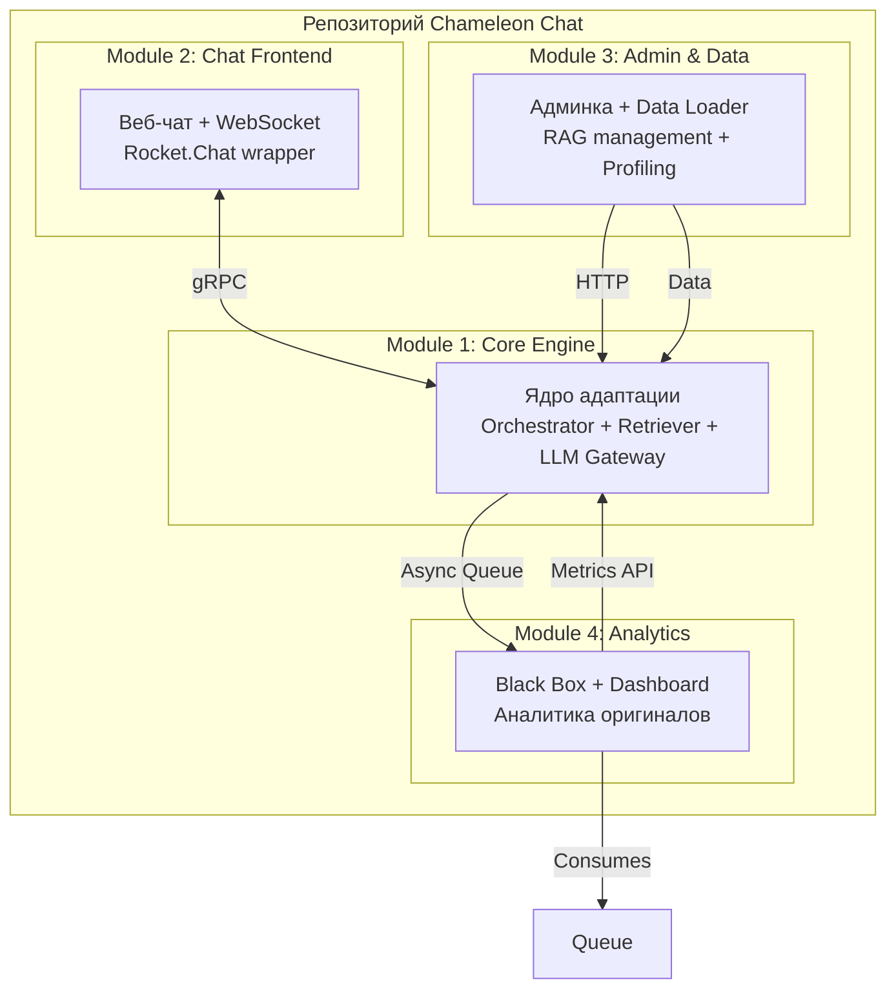

# Расширенная структура репозитория — Chameleon Chat

## Общая концепция мультимодульности

Проект разделён на **4 независимых модуля**, каждый из которых может жить своей жизнью, иметь свой CI/CD, свою технологию и свою команду. Модули общаются через **чёткие API-контракты** (gRPC/REST) и **общую схему данных**.



---

## Полная структура репозитория

```
chameleon-chat/
│
├── README.md                          # Общее описание проекта
├── LICENSE
├── CONTRIBUTING.md
├── Makefile                           # Общие команды (make up, make test)
├── docker-compose.yaml                # Оркестрация всех модулей
├── docker-compose.override.yaml       # Для разработки (горячая перезагрузка)
├── .env.example
├── .gitignore
│
├── docs/                              # Общая документация
│   ├── architecture/
│   │   ├── system_architecture.md
│   │   ├── data_flow.md
│   │   └── api_contracts.md          # Контракты между модулями
│   ├── deployment/
│   │   ├── local_development.md
│   │   ├── production_guide.md
│   │   └── kubernetes/
│   └── user_guides/
│       ├── user_manual.md
│       └── admin_manual.md
│
├── contracts/                         # Общие protobuf/OpenAPI схемы
│   ├── proto/
│   │   ├── orchestrator.proto
│   │   ├── retriever.proto
│   │   ├── llm_gateway.proto
│   │   └── analytics.proto
│   ├── openapi/
│   │   ├── admin_api.yaml
│   │   └── chat_api.yaml
│   └── events/
│       └── message_event.avsc        # Avro схема для Kafka/Redis
│
├── scripts/                           # Общие скрипты
│   ├── bootstrap.sh                   # Первый запуск (скачать модели)
│   ├── seed_data.py                   # Загрузка тестовых данных
│   ├── generate_mock_profiles.py
│   └── run_e2e_tests.sh
│
├── tests/                             # E2E тесты (общие для всех модулей)
│   ├── e2e/
│   │   ├── test_full_flow.py
│   │   ├── test_adaptation.py
│   │   └── test_fallbacks.py
│   ├── performance/
│   │   ├── locustfile.py
│   │   └── scenarios/
│   └── fixtures/
│       ├── messages.json
│       ├── profiles.yaml
│       └── rules.md
│
├── module-1-core-engine/              # ========== МОДУЛЬ 1 ==========
│   ├── README.md
│   ├── pyproject.toml                 # Python проект
│   ├── Dockerfile
│   ├── docker-compose.module.yml      # Только для этого модуля
│   ├── .env
│   │
│   ├── src/
│   │   ├── orchestrator/
│   │   │   ├── __init__.py
│   │   │   ├── main.py                # FastAPI/gRPC сервер
│   │   │   ├── handlers.py
│   │   │   ├── context_assembler.py
│   │   │   ├── cache_manager.py
│   │   │   └── config.py
│   │   │
│   │   ├── retriever/
│   │   │   ├── __init__.py
│   │   │   ├── main.py
│   │   │   ├── qdrant_client.py
│   │   │   ├── embeddings.py
│   │   │   ├── chunking.py
│   │   │   ├── hybrid_search.py
│   │   │   └── ingestion/
│   │   │       ├── file_loader.py
│   │   │       └── api_loader.py
│   │   │
│   │   ├── llm_gateway/
│   │   │   ├── __init__.py
│   │   │   ├── main.py
│   │   │   ├── router.py
│   │   │   ├── providers/
│   │   │   │   ├── base.py
│   │   │   │   ├── ollama_provider.py
│   │   │   │   └── openai_provider.py
│   │   │   ├── cache.py
│   │   │   └── load_balancer.py
│   │   │
│   │   └── common/
│   │       ├── schemas.py
│   │       ├── logging.py
│   │       ├── metrics.py             # Prometheus метрики
│   │       └── langfuse_integration.py
│   │
│   ├── tests/
│   │   ├── unit/
│   │   │   ├── orchestrator/
│   │   │   ├── retriever/
│   │   │   └── llm_gateway/
│   │   ├── integration/
│   │   │   ├── test_orchestrator_retriever.py
│   │   │   └── test_llm_fallbacks.py
│   │   └── conftest.py
│   │
│   ├── scripts/
│   │   ├── download_models.py
│   │   └── warmup_cache.py
│   │
│   └── config/
│       ├── development.yaml
│       ├── production.yaml
│       └── models.yaml                # Какие модели доступны
│
├── module-2-chat-frontend/            # ========== МОДУЛЬ 2 ==========
│   ├── README.md
│   ├── package.json                   # Node.js/React проект
│   ├── Dockerfile
│   ├── docker-compose.module.yml
│   │
│   ├── src/
│   │   ├── backend/
│   │   │   ├── server.js              # Express/WebSocket сервер
│   │   │   ├── websocket/
│   │   │   │   ├── connection_manager.js
│   │   │   │   └── message_handler.js
│   │   │   ├── api/
│   │   │   │   ├── messages.js
│   │   │   │   ├── users.js
│   │   │   │   └── rooms.js
│   │   │   ├── grpc_client/
│   │   │   │   └── orchestrator_client.js
│   │   │   └── config.js
│   │   │
│   │   └── frontend/
│   │       ├── index.html
│   │       ├── src/
│   │       │   ├── App.jsx
│   │       │   ├── components/
│   │       │   │   ├── ChatWindow.jsx
│   │       │   │   ├── MessageList.jsx
│   │       │   │   ├── MessageInput.jsx
│   │       │   │   ├── UserList.jsx
│   │       │   │   ├── StyleSelector.jsx  # Выбор стиля (Чехов и т.д.)
│   │       │   │   └── AdaptationIndicator.jsx
│   │       │   ├── hooks/
│   │       │   │   ├── useWebSocket.js
│   │       │   │   └── useMessages.js
│   │       │   ├── services/
│   │       │   │   └── api.js
│   │       │   └── styles/
│   │       │       └── app.css
│   │       └── public/
│   │
│   ├── tests/
│   │   ├── unit/
│   │   │   └── websocket.test.js
│   │   ├── integration/
│   │   │   └── grpc_integration.test.js
│   │   └── e2e/
│   │       └── chat_flow.spec.js       # Playwright
│   │
│   ├── config/
│   │   ├── nginx.conf
│   │   └── env/
│   │       ├── development.env
│   │       └── production.env
│   │
│   └── assets/
│       ├── default_avatar.png
│       └── sounds/
│           └── notification.mp3
│
├── module-3-admin-data/               # ========== МОДУЛЬ 3 ==========
│   ├── README.md
│   ├── pyproject.toml                 # Python + FastAPI
│   ├── Dockerfile
│   ├── docker-compose.module.yml
│   │
│   ├── src/
│   │   ├── admin_api/
│   │   │   ├── main.py                # FastAPI сервер (порт 8100)
│   │   │   ├── routes/
│   │   │   │   ├── documents.py       # CRUD для RAG документов
│   │   │   │   ├── profiles.py        # Управление профилями
│   │   │   │   ├── rules.py           # Управление правилами
│   │   │   │   ├── styles.py          # Загрузка книг
│   │   │   │   ├── users.py           # Управление пользователями чата
│   │   │   │   └── system.py          # Статус, перезагрузка
│   │   │   ├── services/
│   │   │   │   ├── document_processor.py
│   │   │   │   ├── bulk_importer.py
│   │   │   │   └── profile_generator.py
│   │   │   └── auth.py                # Простая админ-авторизация
│   │   │
│   │   ├── data_loader/
│   │   │   ├── cli.py                 # Команды: load-rules, load-books
│   │   │   ├── connectors/
│   │   │   │   ├── local_fs.py
│   │   │   │   ├── s3_connector.py
│   │   │   │   └── notion_connector.py  # бонус
│   │   │   └── validators/
│   │   │       ├── rule_validator.py
│   │   │       └── book_format_validator.py
│   │   │
│   │   └── frontend_admin/            # React админка
│   │       ├── src/
│   │       │   ├── App.jsx
│   │       │   ├── pages/
│   │       │   │   ├── Dashboard.jsx
│   │       │   │   ├── Documents.jsx   # Загрузка/удаление файлов
│   │       │   │   ├── Profiles.jsx    # Редактор профилей
│   │       │   │   ├── Rules.jsx       # Визуальный редактор правил
│   │       │   │   ├── Styles.jsx      # Загрузка книг
│   │       │   │   └── System.jsx      # Статус сервисов
│   │       │   └── components/
│   │       │       ├── FileUploader.jsx
│   │       │       ├── DataTable.jsx
│   │       │       └── RuleEditor.jsx
│   │       └── package.json
│   │
│   ├── tests/
│   │   ├── unit/
│   │   │   ├── test_document_processor.py
│   │   │   └── test_rule_validator.py
│   │   ├── integration/
│   │   │   └── test_qdrant_operations.py
│   │   └── api_tests/
│   │       └── test_admin_endpoints.py
│   │
│   ├── scripts/
│   │   ├── seed_demo_data.py
│   │   ├── import_corporate_rules.sh
│   │   └── backup_qdrant.sh
│   │
│   └── uploads/                       # Временное хранилище загруженных файлов
│       └── .gitkeep
│
├── module-4-analytics/                # ========== МОДУЛЬ 4 ==========
│   ├── README.md
│   ├── pyproject.toml
│   ├── Dockerfile
│   ├── docker-compose.module.yml
│   │
│   ├── src/
│   │   ├── black_box/
│   │   │   ├── main.py                # Consumer из Redis/RabbitMQ
│   │   │   ├── classifiers/
│   │   │   │   ├── style_classifier.py    # Тон сообщения
│   │   │   │   ├── toxicity_detector.py
│   │   │   │   ├── intent_classifier.py
│   │   │   │   └── cultural_analyzer.py
│   │   │   ├── impact_analyzer.py     # "А что было бы без адаптации"
│   │   │   ├── profile_updater.py     # Обновление профилей на основе истории
│   │   │   ├── few_shot_generator.py  # Создание примеров для обучения
│   │   │   └── storage/
│   │   │       ├── postgres_writer.py
│   │   │       ├── minio_writer.py
│   │   │       └── qdrant_writer.py
│   │   │
│   │   ├── dashboard/                 # FastAPI + Plotly
│   │   │   ├── main.py                # Сервер дашборда (порт 8200)
│   │   │   ├── routes/
│   │   │   │   ├── metrics.py
│   │   │   │   ├── reports.py
│   │   │   │   └── export.py
│   │   │   ├── visualizations/
│   │   │   │   ├── sentiment_trends.py
│   │   │   │   ├── adaptation_effectiveness.py
│   │   │   │   ├── user_behavior.py
│   │   │   │   └── conflict_predictor.py
│   │   │   └── static/
│   │   │       └── index.html         # Встроенный дашборд
│   │   │
│   │   └── rag_evaluator/             # RAGas интеграция
│   │       ├── runner.py              # Запуск оценки
│   │       ├── test_sets/
│   │       │   ├── create_benchmark.py
│   │       │   └── benchmark_v1.json
│   │       └── reporters/
│   │           ├── console_report.py
│   │           └── html_report.py
│   │
│   ├── tests/
│   │   ├── unit/
│   │   │   ├── test_style_classifier.py
│   │   │   └── test_impact_analyzer.py
│   │   ├── integration/
│   │   │   └── test_black_box_pipeline.py
│   │   └── test_ragas/
│   │       └── test_rag_evaluation.py
│   │
│   ├── scripts/
│   │   ├── run_nightly_evaluation.sh
│   │   ├── generate_weekly_report.py
│   │   └── migrate_analytics_db.py
│   │
│   └── notebooks/                     # Jupyter для исследования данных
│       ├── 01_explore_messages.ipynb
│       ├── 02_classifier_training.ipynb
│       └── 03_adaptation_impact_analysis.ipynb
│
└── shared/                            # Код, общий для всех модулей
    ├── pyproject.toml                 # Общая Python библиотека
    ├── src/
    │   ├── shared_models/
    │   │   ├── message.py
    │   │   ├── profile.py
    │   │   ├── rule.py
    │   │   └── event.py
    │   ├── shared_utils/
    │   │   ├── logging_utils.py
    │   │   ├── serialization.py
    │   │   └── retry_decorator.py
    │   ├── grpc_stubs/                # Сгенерированные из contracts/
    │   │   ├── orchestrator_pb2.py
    │   │   ├── orchestrator_pb2_grpc.py
    │   │   └── ...
    │   └── config/
    │       ├── settings.py
    │       └── schemas.py
    │
    └── tests/
        └── test_shared_utils.py
```

---

## Детальное описание каждого модуля

### Модуль 1: Core Engine — «Мозг системы»

**Ответственность:** Всё, что связано с адаптацией текста:
- Orchestrator (координация)
- Retriever (RAG из Qdrant)
- LLM Gateway (маршрутизация моделей)

**Входы:** gRPC запросы от чата и админки  
**Выходы:** Адаптированный текст + асинхронные события в очередь

**Особенности:**
- Самый критичный по производительности модуль
- Может запускаться в нескольких репликах
- Зависит от Qdrant и Ollama (внешние)

**Технологии:** Python 3.11, FastAPI, gRPC, Qdrant, Redis

**Интерфейсные контракты:**
- `orchestrator.proto` — основной API для чата
- `admin.proto` — для управления RAG из админки

---

### Модуль 2: Chat Frontend — «Лицо системы»

**Ответственность:**
- Веб-чат (UI/UX)
- WebSocket соединения
- Адаптация под разные устройства

**Входы:** HTTP/WebSocket от браузера  
**Выходы:** gRPC вызовы в Core Engine

**Важное архитектурное решение:** Мы **не** модифицируем готовый OpenSource чат (Rocket.Chat), а **оборачиваем** его или пишем свой минимальный чат. Почему:
- Полный контроль над каждым сообщением
- Легко добавить UI для выбора стиля (`/style chekhov`)
- Нет необходимости хакать чужой код

**Технологии:** Node.js, Express, WebSocket, React, TailwindCSS

**Компоненты:**
- `StyleSelector` — выпадающий список (Без стиля / Чехов / Довлатов / Пелевин / Ильф и Петров)
- `AdaptationIndicator` — иконка, показывающая, что сообщение адаптировано
- `WebSocket Manager` — поддерживает соединения и реконнекты

**Маршруты API:**
- `GET /api/rooms` — список чатов
- `GET /api/users` — список пользователей
- `POST /api/messages` — отправка сообщения (через HTTP fallback)
- `WS /ws` — WebSocket для реального времени

---

### Модуль 3: Admin & Data — «Командный пункт»

**Ответственность:**
1. **Админка:** Управление всеми данными через веб-интерфейс
2. **Data Loader:** Загрузка документов в RAG
3. **Управление профилями:** Создание, редактирование, импорт

**Входы:** HTTP от браузера администратора, CLI команды  
**Выходы:** Прямые вызовы в Qdrant и Core Engine

**Что можно делать в админке:**
- Загрузить PDF с корпоративными правилами → автоматически в RAG
- Добавить книгу Чехова (TXT/EPUB) → в коллекцию стилей
- Создать/редактировать профиль сотрудника (должность, обращение)
- Посмотреть статус всех сервисов (healthchecks)
- Запустить переиндексацию всех документов

**API для Data Loader:**
```
POST /api/documents/upload      # Загрузить файл (PDF, TXT, MD)
POST /api/documents/import-bulk  # ZIP со множеством файлов
DELETE /api/documents/{id}       # Удалить документ из RAG
GET  /api/documents/status       # Статус индексации

POST /api/profiles/import-csv    # Импорт пользователей из CSV
POST /api/profiles/generate-test  # Сгенерировать 10 тестовых профилей

POST /api/rules/reload           # Перезагрузить правила без рестарта
```

**Админка (UI):**
- React + React-Admin или простой самописный вариант
- Таблицы с фильтрацией и поиском
- Drag-and-drop загрузка файлов

**CLI (для скриптов):**
```bash
python -m chameleon.data_loader load-rules --path ./rules/
python -m chameleon.data_loader load-books --author Chekhov
python -m chameleon.profiles generate --count 100 --output profiles.json
```

---

### Модуль 4: Analytics & Dashboard — «Рефлексия системы»

**Ответственность:**
1. **Black Box:** Анализ оригинальных сообщений (не адаптированных)
2. **Dashboard:** Визуализация метрик и инсайтов
3. **RAG Evaluation:** Автоматическая оценка качества RAG

**Входы:** Очередь сообщений (Redis Streams / RabbitMQ)  
**Выходы:**
- Данные в PostgreSQL (для дашборда)
- Метрики в Prometheus
- Отчёты в HTML/JSON

**Black Box — внутренняя логика:**

При получении сообщения из очереди `(original, adapted, metadata)`:

1. **Style Classifier** (LLM-based, локальный)
    - Оценивает тон оригинала (агрессивный, нейтральный, дружелюбный)
    - Определяет формальность (1-10)
    - Маркирует наличие сарказма, угроз, нецензурной лексики

2. **Impact Analyzer**
    - Симулирует: "А что было бы, если бы это сообщение ушло без адаптации?"
    - Использует вторую LLM (дешёвую) для предсказания реакции получателя
    - Сравнивает с реальным ответом (через некоторое время)

3. **Profile Updater**
    - Обновляет `adaptive_history` в профиле отправителя (вектор последних 20 сообщений)
    - Если пользователь часто пишет агрессивно → меняем его `communication_mode` на "needs_gentle_adaptation"

4. **Few-Shot Generator**
    - Успешные адаптации сохраняет как примеры для будущих промптов
    - Хранит в отдельной коллекции Qdrant

**Dashboard — что показывает:**

| Страница | Что показывает | Для кого |
|----------|----------------|----------|
| **Sentiment Trends** | График настроения в чатах по дням/неделям | HR, руководители |
| **Adaptation Effectiveness** | % сообщений, которые были изменены; насколько изменилась тональность | Разработчики системы |
| **Top Triggers** | Какие фразы чаще всего требуют адаптации («ты должен», «срочно», «ошибка») | Для улучшения правил |
| **User Behavior** | Кто чаще пишет агрессивно, кто вежливо | HR (анонимно) |
| **Conflict Predictor** | Прогноз: в каком чате скоро возникнет конфликт на основе тона | Упреждающее вмешательство |
| **RAG Quality** | faithfulness, answer_relevancy по дням | Разработчики |

**RAG Evaluator (отдельный компонент):**
- Запускается nightly через cron/GitHub Actions
- Берёт тестовый набор из 100 вопросов + ожидаемые ответы
- Прогоняет через текущий RAG пайплайн
- Вычисляет метрики и шлёт отчёт в Telegram/Slack (или сохраняет в дашборд)

---

## Межмодульные взаимодействия (API контракты)

### Контракт 1: Чат → Core Engine (gRPC)

```protobuf
service Orchestrator {
  rpc ProcessMessage (MessageRequest) returns (MessageResponse);
}

message MessageRequest {
  string message_id = 1;
  string sender_id = 2;
  string recipient_id = 3;
  string text = 4;
  optional string style_name = 5;  // "chekhov", "dovlatov"...
  map<string, string> metadata = 6;
}

message MessageResponse {
  string adapted_text = 1;
  bool was_adapted = 2;
  float confidence = 3;
  string model_used = 4;
  int64 processing_time_ms = 5;
}
```

### Контракт 2: Admin → Core Engine (REST)

```yaml
POST: /api/v1/rag/ingest
Content-Type: multipart/form-data

file: <binary>
collection: "corporate_rules"
metadata: {"author": "..."}
```

### Контракт 3: Core Engine → Analytics (Асинхронный Event)

```json
{
  "event_type": "message_processed",
  "timestamp": "2024-01-15T10:30:00Z",
  "original_message": {
    "text": "...",
    "sender_id": "user_123",
    "recipient_id": "user_456"
  },
  "adapted_message": {
    "text": "...",
    "was_adapted": true,
    "model_used": "mixtral:8x7b"
  },
  "metadata": {
    "rules_applied": ["rule_001", "rule_042"],
    "style_used": "chekhov"
  }
}
```

---

## Зависимости между модулями (DAG сборки)

```yaml
build_order:
  - shared (общая библиотека)
  
  - module-1-core-engine:
      depends_on: [shared]
      requires_external: [qdrant, ollama, redis]
      
  - module-3-admin-data:
      depends_on: [shared]
      may_run_without: [module-1] (но с ограничениями)
      
  - module-2-chat-frontend:
      depends_on: [shared]
      requires: [module-1] (без него бесполезен)
      
  - module-4-analytics:
      depends_on: [shared, module-1]
      requires_external: [postgres, minio]
```

---

## Общая Docker Compose (связывающая всё)

```yaml
# docker-compose.yaml (в корне)
version: "3.8"

services:
  # Инфраструктура (общая)
  qdrant:
    image: qdrant/qdrant:v1.7.0
    volumes: [qdrant_data:/qdrant/storage]
    
  ollama:
    image: ollama/ollama:latest
    volumes: [ollama_data:/root/.ollama]
    deploy:
      resources:
        reservations:
          devices: [{driver: nvidia, count: 1, capabilities: [gpu]}]
          
  redis:
    image: redis:7-alpine
    
  postgres:
    image: postgres:15-alpine
    environment: {POSTGRES_DB: chameleon}
    
  minio:
    image: minio/minio:latest
    
  # Модули
  core-engine:
    build: ./module-1-core-engine
    ports: ["8001:8001"]  # gRPC
    depends_on: [qdrant, ollama, redis]
    
  chat-frontend:
    build: ./module-2-chat-frontend
    ports: ["8080:8080"]  # Web UI
    depends_on: [core-engine]
    
  admin-data:
    build: ./module-3-admin-data
    ports: ["8100:8100"]  # Admin UI
    depends_on: [core-engine, qdrant]
    
  analytics:
    build: ./module-4-analytics
    ports: ["8200:8200"]  # Dashboard
    depends_on: [core-engine, postgres, minio, redis]
    
volumes:
  qdrant_data:
  ollama_data:
```

---

## Разработка и тестирование

### Для разработчика, который хочет добавить новую модель в LLM Gateway:

```bash
# 1. Клонировать репозиторий
git clone https://github.com/company/chameleon-chat.git
cd chameleon-chat

# 2. Поднять только нужный модуль с зависимостями
cd module-1-core-engine
docker-compose -f docker-compose.module.yml up -d

# 3. Внести изменения в src/llm_gateway/providers/new_provider.py

# 4. Запустить unit-тесты модуля
pytest tests/unit/llm_gateway/

# 5. Запустить интеграционные тесты (с реальным Ollama)
pytest tests/integration/

# 6. Запустить E2E тесты всей системы (из корня)
cd ../..
make e2e-tests

# 7. Сделать PR
```

### Makefile команды:

```makefile
.PHONY: up down test e2e logs clean

up:
	docker-compose up -d

down:
	docker-compose down

test:
	pytest tests/unit/

integration-tests:
	pytest tests/integration/

e2e:
	pytest tests/e2e/

logs:
	docker-compose logs -f

clean:
	docker-compose down -v
	rm -rf ./data/
```

---

## Стратегия ветвления (Git Flow)

```
main                     # production-ready
  ├── develop            # интеграция модулей
  │   ├── feature/module-1-ollama-fallback
  │   ├── feature/module-2-dark-theme
  │   ├── feature/module-3-csv-import
  │   └── feature/module-4-new-dashboard
  ├── release/v1.0.0
  └── hotfix/redis-connection
```

**Правила:**
- Каждый модуль имеет свою папку, но общий Git репозиторий (монорепозиторий)
- Pull Request должен проходить:
    - Тесты изменённого модуля
    - Линтеры (ruff для Python, eslint для JS)
    - Контрактные тесты (не нарушен ли gRPC API)
- В `develop` мержим только после успешного E2E теста всей системы

---

## Заключение: почему такая структура?

| Преимущество | Как достигается |
|--------------|------------------|
| **Независимая разработка** | 4 модуля с разными технологиями (Python, Node.js) |
| **Масштабирование** | Каждый модуль можно запустить в N репликах |
| **Тестируемость** | Моки контрактов позволяют тестировать модули изолированно |
| **Удобство онбординга** | Новый разработчик может взять один модуль и не погружаться в остальные |
| **Переиспользование** | `shared/` библиотека с общими моделями |
| **CI/CD** | Можно деплоить модули по отдельности |
| **Документация** | Контракты в `contracts/` — единый источник правды |
