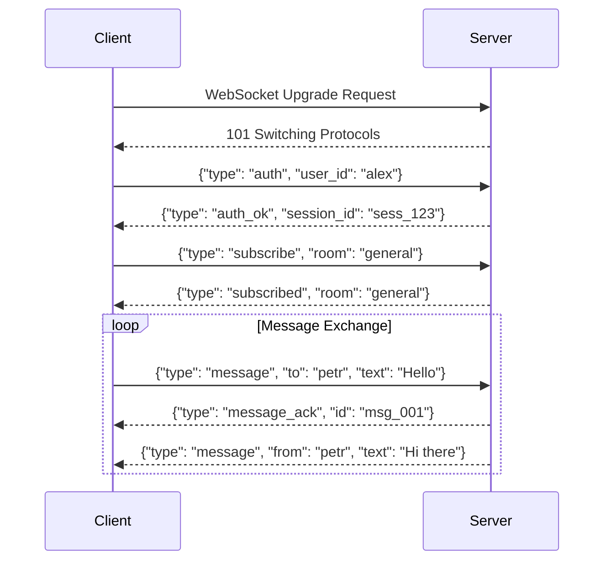

# API Contracts Documentation — Chameleon Chat

## Версия 1.0.0 | 15 января 2024

---

## 1. Введение

### 1.1. Обзор API

Документ описывает все API-контракты между модулями системы Chameleon Chat. API разделены на **внешние** (для клиентов)и
**внутренние** (между микросервисами).

| Тип API                | Протокол             | Используется для                   | Стороны             |
|------------------------|----------------------|------------------------------------|---------------------|
| **Внешний (Client)**   | HTTP/1.1 + WebSocket | Чат UI ↔ API Gateway               | Пользователи        |
| **Внутренний (Core)**  | gRPC (HTTP/2)        | Gateway ↔ Orchestrator ↔ Retriever | Сервисы Core Engine |
| **Внутренний (Admin)** | HTTP/1.1 (REST)      | Admin UI ↔ Admin API               | Администраторы      |
| **Событийный**         | Redis Streams        | Orchestrator ↔ Black Box           | Асинхронные события |

### 1.2. Версионирование

```
API Versioning Strategy:
- External APIs: /api/v1/ (URL versioning)
- Internal APIs: gRPC reflection, proto version in package
- Breaking changes: increment major version
```

---

## 2. External API (Client ↔ API Gateway)

### 2.1. WebSocket API (Real-time messaging)

**Endpoint:** `ws://localhost:8081/ws?token={jwt}`

**Connection flow:**



**Message schemas:**

#### 2.1.1. Send message (Client → Server)

```json
{
  "type": "message",
  "id": "msg_client_001",
  "to": "user_petr_smirnov",
  "room": "engineering_chat",
  "text": "Petr, привет! Как дела?",
  "style": "chekhov",
  "attachments": [],
  "reply_to": null
}
```

| Field         | Type   | Required | Description                                   |
|---------------|--------|----------|-----------------------------------------------|
| `type`        | string | ✅        | Always "message"                              |
| `id`          | string | ✅        | Client-generated UUID                         |
| `to`          | string | ❌        | Recipient user_id (null for room)             |
| `room`        | string | ❌        | Room ID (null for direct)                     |
| `text`        | string | ✅        | Original message (1-4000 chars)               |
| `style`       | string | ❌        | "chekhov", "dovlatov", "pelevin", "ilfpetrov" |
| `attachments` | array  | ❌        | File references                               |
| `reply_to`    | string | ❌        | Message ID being replied to                   |

#### 2.1.2. Message acknowledgment (Server → Client)

```json
{
  "type": "message_ack",
  "client_id": "msg_client_001",
  "server_id": "msg_01H3X2Y5K8",
  "status": "received",
  "timestamp": "2024-01-15T10:30:00Z"
}
```

#### 2.1.3. Delivered message (Server → Client)

```json
{
  "type": "message",
  "id": "msg_01H3X2Y5K8",
  "from": "user_alex_ivanov",
  "to": "user_petr_smirnov",
  "room": null,
  "text": "Петр Иванович, доброе утро! Как ваши дела?",
  "original_text": "Petr, привет! Как дела?",
  "was_adapted": true,
  "adaptation_metadata": {
    "style_used": "chekhov",
    "confidence": 0.92
  },
  "timestamp": "2024-01-15T10:30:00Z"
}
```

| Field                 | Type    | Description                           |
|-----------------------|---------|---------------------------------------|
| `was_adapted`         | boolean | Whether message was modified          |
| `original_text`       | string  | Original (only if `was_adapted=true`) |
| `adaptation_metadata` | object  | Details of adaptation                 |

#### 2.1.4. Error message (Server → Client)

```json
{
  "type": "error",
  "code": "RATE_LIMIT_EXCEEDED",
  "message": "Too many messages. Please wait 5 seconds.",
  "retry_after_ms": 5000
}
```

**Error codes:**

| Code                  | Description             | Retry                     |
|-----------------------|-------------------------|---------------------------|
| `RATE_LIMIT_EXCEEDED` | Too many requests       | Yes (after delay)         |
| `MESSAGE_TOO_LONG`    | Exceeds 4000 chars      | No                        |
| `USER_NOT_FOUND`      | Recipient doesn't exist | No                        |
| `LLM_TIMEOUT`         | Adaptation took >5s     | Yes                       |
| `INTERNAL_ERROR`      | Server error            | Yes (exponential backoff) |

### 2.2. HTTP REST API

**Base URL:** `http://localhost:8000/api/v1`

#### 2.2.1. Get user profile

```
GET /users/{user_id}
Authorization: Bearer {jwt}
```

**Response (200 OK):**

```json
{
  "user_id": "user_alex_ivanov",
  "full_name": "Иванов Алексей Петрович",
  "role": "engineer",
  "department": "backend",
  "online": true,
  "last_seen": "2024-01-15T10:25:00Z"
}
```

#### 2.2.2. Get room history

```
GET /rooms/{room_id}/messages?limit=50&before=msg_xxx
Authorization: Bearer {jwt}
```

**Response (200 OK):**

```json
{
  "messages": [
    {
      "id": "msg_01H3X2Y5K8",
      "from": "user_alex_ivanov",
      "text": "Адаптированное сообщение...",
      "was_adapted": true,
      "timestamp": "2024-01-15T10:30:00Z"
    }
  ],
  "next_cursor": "msg_01H3X2Y5K0",
  "has_more": true
}
```

#### 2.2.3. Get available styles

```
GET /styles
Authorization: Bearer {jwt}
```

**Response (200 OK):**

```json
{
  "styles": [
    {
      "id": "chekhov",
      "name": "Антон Чехов",
      "description": "Ироничный, меланхоличный, с грустинкой",
      "icon": "📖",
      "is_default": true
    },
    {
      "id": "dovlatov",
      "name": "Сергей Довлатов",
      "description": "Самоирония, короткие фразы, советский колорит",
      "icon": "✍️",
      "is_default": false
    }
  ]
}
```

#### 2.2.4. Set user style preference

```
POST /users/{user_id}/preferences
Authorization: Bearer {jwt}
Content-Type: application/json

{
  "default_style": "chekhov",
  "auto_adapt": true,
  "show_original": false
}
```

**Response (200 OK):**

```json
{
  "success": true,
  "preferences": {
    "default_style": "chekhov",
    "auto_adapt": true,
    "show_original": false,
    "updated_at": "2024-01-15T10:35:00Z"
  }
}
```

---

## 3. Internal API: Core Engine (gRPC)

### 3.1. Proto definition

```protobuf
syntax = "proto3";

package chameleon.core.v1;

option go_package = "chameleon/core/v1;corev1";

service OrchestratorService {
    rpc ProcessMessage(ProcessMessageRequest) returns (ProcessMessageResponse);
    rpc HealthCheck(Empty) returns (HealthStatus);
}

service RetrieverService {
    rpc GetProfile(GetProfileRequest) returns (UserProfile);
    rpc GetRules(GetRulesRequest) returns (GetRulesResponse);
    rpc GetStyleExamples(GetStyleExamplesRequest) returns (GetStyleExamplesResponse);
    rpc SearchRules(SearchRulesRequest) returns (SearchRulesResponse);
}

service LLMGatewayService {
    rpc Generate(GenerateRequest) returns (GenerateResponse);
    rpc StreamGenerate(GenerateRequest) returns (stream GenerateResponse);
    rpc GetModelStatus(Empty) returns (ModelStatusResponse);
}
```

### 3.2. Orchestrator Service

#### 3.2.1. ProcessMessage

```protobuf
message ProcessMessageRequest {
    string message_id = 1;
    string sender_id = 2;
    string recipient_id = 3;
    string room_id = 4;
    string text = 5;
    optional string style_name = 6;
    map<string, string> metadata = 7;
}

message ProcessMessageResponse {
    string adapted_text = 1;
    bool was_adapted = 2;
    float confidence = 3;
    string model_used = 4;
    int64 processing_time_ms = 5;
    repeated string rules_applied = 6;
    AdaptationMetadata adaptation_metadata = 7;
}

message AdaptationMetadata {
    bool from_cache = 1;
    bool fallback_used = 2;
    string fallback_reason = 3;
    int32 tokens_prompt = 4;
    int32 tokens_completion = 5;
}
```

**Validation rules:**

- `text`: 1-4000 characters, no control characters
- `sender_id` and `recipient_id`: must exist in system
- `style_name`: if provided, must be in predefined list

**Error responses (gRPC status codes):**
| Code | Condition |
|------|-----------|
| `INVALID_ARGUMENT` | Invalid message format |
| `NOT_FOUND` | Sender or recipient not found |
| `DEADLINE_EXCEEDED` | LLM timeout (>5 seconds) |
| `RESOURCE_EXHAUSTED` | Rate limit exceeded |
| `INTERNAL` | Internal server error |

### 3.3. Retriever Service

#### 3.3.1. GetProfile

```protobuf
message GetProfileRequest {
    string user_id = 1;
    bool include_history = 2;  // Include embedding vector
}

message UserProfile {
    string user_id = 1;
    string full_name = 2;
    string role = 3;
    string department = 4;
    HonorificType honorific_type = 5;
    CommunicationMode communication_mode = 6;
    repeated string known_triggers = 7;
    repeated float adaptive_history_vector = 8;  // 768 floats, optional
    int64 last_updated = 9;
}

enum HonorificType {
    HONORIFIC_UNSPECIFIED = 0;
    FIRST_NAME = 1;      // "Алексей"
    FIRST_LAST = 2;      // "Алексей Иванов"
    PATRONYMIC = 3;      // "Алексей Петрович"
    TITLE_LAST = 4;      // "господин Иванов"
}

enum CommunicationMode {
    MODE_UNSPECIFIED = 0;
    FORMAL = 1;
    INFORMAL = 2;
    TECHNICAL = 3;
    DIPLOMATIC = 4;
}
```

#### 3.3.2. GetRules

```protobuf
message GetRulesRequest {
    string sender_role = 1;
    string recipient_role = 2;
    string message_text = 3;
    int32 limit = 4;  // Default 5, max 20
}

message GetRulesResponse {
    repeated CorporateRule rules = 1;
}

message CorporateRule {
    string rule_id = 1;
    string category = 2;
    int32 priority = 3;
    string transformation_prompt = 4;
    string example_original = 5;
    string example_adapted = 6;
    float relevance_score = 7;
}
```

**Search logic:**

1. Vector search on `message_text` (semantic matching)
2. Filter by `sender_role` and `recipient_role`
3. Sort by `priority` (descending)
4. Return top `limit` results

#### 3.3.3. GetStyleExamples

```protobuf
message GetStyleExamplesRequest {
    string style_name = 1;
    int32 sample_count = 2;  // Default 3, max 10
}

message GetStyleExamplesResponse {
    repeated StyleExample examples = 1;
}

message StyleExample {
    string style_name = 1;
    string author = 2;
    string sample_text = 3;
    map<string, string> metadata = 4;
}
```

**Response caching:** Results cached for 24 hours (styles rarely change)

### 3.4. LLM Gateway Service

#### 3.4.1. Generate

```protobuf
message GenerateRequest {
    string prompt = 1;
    ModelComplexity complexity = 2;
    GenerationConfig config = 3;
}

enum ModelComplexity {
    COMPLEXITY_UNSPECIFIED = 0;
    FAST = 1;       // llama3.2:3b, <200ms target
    BALANCED = 2;   // qwen2.5:7b, <500ms target
    POWERFUL = 3;   // mixtral:8x7b, <1500ms target
}

message GenerationConfig {
    float temperature = 1;  // 0.0-1.0, default 0.7
    int32 max_tokens = 2;   // default 2048
    bool stream = 3;        // for streaming responses
    repeated string stop_sequences = 4;
}

message GenerateResponse {
    string text = 1;
    string model_used = 2;
    ModelComplexity complexity_used = 3;
    TokenUsage token_usage = 4;
    int64 latency_ms = 5;
    bool from_cache = 6;
}

message TokenUsage {
    int32 prompt_tokens = 1;
    int32 completion_tokens = 2;
    int32 total_tokens = 3;
}
```

**Routing logic (implemented in LLM Gateway):**

```python
def route_request(complexity, prompt_length, has_style):
    if complexity == FAST or (prompt_length < 500 and not has_style):
        return "ollama:llama3.2:3b"
    elif complexity == BALANCED or has_style:
        return "ollama:qwen2.5:7b"
    else:
        # Try local powerful, fallback to API
        return try_fallback("ollama:mixtral:8x7b", "openai:gpt-4o")
```

---

## 4. Admin API (REST)

**Base URL:** `http://localhost:8100/api/v1/admin`

**Authentication:** API Key in header: `X-API-Key: {admin_key}`

### 4.1. Document Management

#### 4.1.1. Upload document to RAG

```
POST /documents/upload
Content-Type: multipart/form-data
X-API-Key: admin_123

Form data:
- file: (binary) .txt, .md, .pdf, .json
- collection: "corporate_rules" | "artistic_styles"
- metadata: {"author": "HR Dept", "category": "address"}
```

**Response (202 Accepted):**

```json
{
  "job_id": "job_01H3X2Y5K8",
  "status": "processing",
  "estimated_completion": "2024-01-15T10:35:00Z",
  "documents_expected": 42
}
```

#### 4.1.2. Check ingestion status

```
GET /documents/jobs/{job_id}
X-API-Key: admin_123
```

**Response (200 OK):**

```json
{
  "job_id": "job_01H3X2Y5K8",
  "status": "completed",
  "documents_ingested": 42,
  "failed_chunks": 0,
  "completed_at": "2024-01-15T10:35:12Z",
  "error_log": null
}
```

#### 4.1.3. List documents in collection

```
GET /documents?collection=corporate_rules&limit=50&offset=0
X-API-Key: admin_123
```

**Response (200 OK):**

```json
{
  "documents": [
    {
      "id": "doc_001",
      "collection": "corporate_rules",
      "file_name": "communication_policy.md",
      "chunk_count": 15,
      "uploaded_at": "2024-01-10T10:00:00Z",
      "uploaded_by": "admin@chameleon.local"
    }
  ],
  "total": 42,
  "limit": 50,
  "offset": 0
}
```

#### 4.1.4. Delete document

```
DELETE /documents/{document_id}
X-API-Key: admin_123
```

**Response (200 OK):**

```json
{
  "success": true,
  "document_id": "doc_001",
  "chunks_deleted": 15
}
```

### 4.2. Profile Management

#### 4.2.1. Import users from CSV

```
POST /profiles/import
Content-Type: multipart/form-data
X-API-Key: admin_123

Form data:
- file: (binary) CSV file
- format: "csv" | "json"
```

**Expected CSV format:**

```csv
user_id,full_name,role,department,honorific_type,communication_mode
alex_i,Иванов Алексей,engineer,backend,patronymic,informal
petr_s,Смирнов Петр,team_lead,backend,patronymic,formal
```

**Response (200 OK):**

```json
{
  "imported": 25,
  "updated": 3,
  "failed": 0,
  "errors": []
}
```

#### 4.2.2. Get all profiles

```
GET /profiles?role=engineer&department=backend&limit=100
X-API-Key: admin_123
```

**Response (200 OK):**

```json
{
  "profiles": [
    {
      "user_id": "alex_i",
      "full_name": "Иванов Алексей",
      "role": "engineer",
      "department": "backend",
      "honorific_type": "patronymic",
      "communication_mode": "informal",
      "adaptive_history_vector_preview": [
        0.12,
        -0.34
      ],
      "last_updated": "2024-01-15T09:00:00Z"
    }
  ]
}
```

#### 4.2.3. Update single profile

```
PUT /profiles/{user_id}
Content-Type: application/json
X-API-Key: admin_123

{
  "full_name": "Иванов Алексей Петрович",
  "role": "senior_engineer",
  "communication_mode": "diplomatic",
  "known_triggers": ["deadline", "blame"]
}
```

**Response (200 OK):**

```json
{
  "success": true,
  "profile_updated": "alex_i"
}
```

### 4.3. System Management

#### 4.3.1. Get system status

```
GET /system/status
X-API-Key: admin_123
```

**Response (200 OK):**

```json
{
  "services": {
    "orchestrator": {
      "status": "healthy",
      "uptime_seconds": 86400,
      "replicas": 2,
      "qps": 15.5
    },
    "llm_gateway": {
      "status": "degraded",
      "message": "Ollama high latency, fallback to OpenAI 12% of requests",
      "models": {
        "llama3.2:3b": "available",
        "qwen2.5:7b": "available",
        "mixtral:8x7b": "timeout"
      }
    },
    "qdrant": {
      "status": "healthy",
      "vectors_total": 12483,
      "collections": [
        "profiles",
        "rules",
        "styles"
      ]
    }
  },
  "metrics_5min": {
    "total_requests": 1250,
    "p95_latency_ms": 487,
    "error_rate": 0.008,
    "cache_hit_rate": 0.34
  }
}
```

#### 4.3.2. Clear cache

```
POST /system/cache/clear
Content-Type: application/json
X-API-Key: admin_123

{
  "pattern": "user:*",  // optional, clear all if omitted
  "collection": "adaptations"
}
```

**Response (200 OK):**

```json
{
  "success": true,
  "keys_cleared": 1247,
  "collections_affected": [
    "adaptation_cache"
  ]
}
```

#### 4.3.3. Reload rules (without restart)

```
POST /system/rules/reload
X-API-Key: admin_123
```

**Response (200 OK):**

```json
{
  "success": true,
  "rules_loaded": 42,
  "previous_version": "2024-01-10",
  "new_version": "2024-01-15"
}
```

---

## 5. Event Contract (Async — Orchestrator → Black Box)

### 5.1. Redis Stream Schema

**Stream name:** `chameleon:messages:processed`

**Consumer group:** `blackbox_group`

**Message structure:**

```json
{
  "event_id": "evt_01H3X2Y5K8_001",
  "event_version": "1.0",
  "event_type": "message.processed",
  "timestamp": "2024-01-15T10:30:01.234Z",
  "correlation_id": "c8f3a9b2-4d5e-4a1b-9c3d-7e8f2a1b4c5d",
  "source": "orchestrator",
  "data": {
    "original": {
      "message_id": "msg_01H3X2Y5K8",
      "sender_id": "user_alex_ivanov",
      "recipient_id": "user_petr_smirnov",
      "text": "Petr, ты сломал сборку. Почини.",
      "timestamp": "2024-01-15T10:30:00Z"
    },
    "adapted": {
      "text": "Петр Иванович, вы не находите, что сборка сегодня дышит как-то тяжело?",
      "was_adapted": true,
      "model_used": "qwen2.5:7b",
      "processing_time_ms": 487
    },
    "metadata": {
      "rules_applied": [
        "rule_001",
        "rule_042"
      ],
      "style_used": "chekhov",
      "cache_hit": false,
      "fallback_used": false
    }
  }
}
```

### 5.2. Dead Letter Queue (DLQ)

**Stream name:** `chameleon:messages:dead`

**When message goes to DLQ:**

- Processing failed 3 times in Black Box
- Message schema validation failed
- Timestamp > 24 hours old

**DLQ message example:**

```json
{
  "original_event": {

  },
  "failure_reason": "Schema validation failed: missing 'sender_id'",
  "failed_at": "2024-01-15T10:35:00Z",
  "retry_count": 3
}
```

---

## 6. Observability APIs

### 6.1. Prometheus Metrics Endpoint

**Internal endpoint:** `http://localhost:8001/metrics`

```prometheus
# HELP chameleon_requests_total Total requests
# TYPE chameleon_requests_total counter
chameleon_requests_total{service="orchestrator",endpoint="ProcessMessage"} 1250

# HELP chameleon_request_duration_seconds Request latency
# TYPE chameleon_request_duration_seconds histogram
chameleon_request_duration_seconds_bucket{service="llm_gateway",le="0.1"} 450
chameleon_request_duration_seconds_bucket{service="llm_gateway",le="0.5"} 890

# HELP chameleon_cache_hit_total Cache hits
chameleon_cache_hit_total{service="orchestrator",cache_type="adaptation"} 425

# HELP chameleon_fallback_total Fallback events
chameleon_fallback_total{service="llm_gateway",from="ollama",to="openai"} 12
```

### 6.2. Health Check Endpoint

**Endpoint:** `GET /health`

**Response (200 OK — healthy):**

```json
{
  "status": "healthy",
  "version": "1.0.0",
  "checks": {
    "grpc_server": "up",
    "redis": "up (latency 2ms)",
    "qdrant": "up (vectors 12483)",
    "ollama": "degraded (latency 1200ms > threshold 500ms)"
  },
  "uptime_seconds": 86400,
  "timestamp": "2024-01-15T10:30:00Z"
}
```

**Response (503 — unhealthy):**

```json
{
  "status": "unhealthy",
  "version": "1.0.0",
  "checks": {
    "grpc_server": "up",
    "redis": "down (connection refused)",
    "qdrant": "up",
    "ollama": "up"
  },
  "error": "redis: dial tcp 127.0.0.1:6379: connect: connection refused",
  "timestamp": "2024-01-15T10:30:00Z"
}
```

---

## 7. Error Handling Guide

### 7.1. HTTP Status Codes (REST APIs)

| Status | Name                  | Description              | Retry                     |
|--------|-----------------------|--------------------------|---------------------------|
| 200    | OK                    | Success                  | No                        |
| 202    | Accepted              | Async operation started  | No                        |
| 400    | Bad Request           | Invalid input            | No                        |
| 401    | Unauthorized          | Missing/invalid API key  | No                        |
| 403    | Forbidden             | Insufficient permissions | No                        |
| 404    | Not Found             | Resource doesn't exist   | No                        |
| 409    | Conflict              | Resource already exists  | No                        |
| 429    | Too Many Requests     | Rate limit exceeded      | Yes (after delay)         |
| 500    | Internal Server Error | Server error             | Yes (exponential backoff) |
| 503    | Service Unavailable   | Dependency down          | Yes (with jitter)         |

### 7.2. gRPC Status Codes

| Code                | Number | Description           | Retry             |
|---------------------|--------|-----------------------|-------------------|
| OK                  | 0      | Success               | No                |
| CANCELLED           | 1      | Request cancelled     | No                |
| INVALID_ARGUMENT    | 3      | Invalid proto message | No                |
| DEADLINE_EXCEEDED   | 4      | Timeout               | Yes               |
| NOT_FOUND           | 5      | Resource not found    | No                |
| ALREADY_EXISTS      | 6      | Duplicate             | No                |
| PERMISSION_DENIED   | 7      | Auth failed           | No                |
| RESOURCE_EXHAUSTED  | 8      | Rate limit            | Yes (after delay) |
| FAILED_PRECONDITION | 9      | System not ready      | No                |
| ABORTED             | 10     | Concurrency conflict  | Yes               |
| OUT_OF_RANGE        | 11     | Pagination error      | No                |
| UNIMPLEMENTED       | 12     | Feature not ready     | No                |
| INTERNAL            | 13     | Server error          | Yes               |
| UNAVAILABLE         | 14     | Service down          | Yes               |
| DATA_LOSS           | 15     | Data corrupted        | No                |

### 7.3. Retry Policy

```yaml
retry_policy:
  max_attempts: 3
  initial_backoff_ms: 100
  max_backoff_ms: 10000
  backoff_multiplier: 2.0
  retryable_statuses:
    - DEADLINE_EXCEEDED
    - RESOURCE_EXHAUSTED
    - ABORTED
    - INTERNAL
    - UNAVAILABLE
  non_retryable_statuses:
    - INVALID_ARGUMENT
    - NOT_FOUND
    - PERMISSION_DENIED
```

### 7.4. Rate Limits

| API                            | Limit | Window   | Burst |
|--------------------------------|-------|----------|-------|
| `POST /api/v1/messages`        | 30    | 60 sec   | 5     |
| `GET /api/v1/rooms/*/messages` | 120   | 60 sec   | 20    |
| WebSocket messages             | 10    | 10 sec   | 2     |
| Admin API (all endpoints)      | 300   | 60 sec   | 50    |
| `POST /documents/upload`       | 10    | 3600 sec | 2     |

**Rate limit response headers:**

```
X-RateLimit-Limit: 30
X-RateLimit-Remaining: 12
X-RateLimit-Reset: 1705315200
Retry-After: 15
```

---

## 8. API Examples

### 8.1. Full chat flow example

**1. Connect WebSocket:**

```javascript
const ws = new WebSocket('ws://localhost:8081/ws?token=jwt_123');
ws.onopen = () => {
  ws.send(JSON.stringify({
    type: 'auth',
    user_id: 'alex_i'
  }));
};
```

**2. Send message:**

```javascript
ws.send(JSON.stringify({
  type: 'message',
  id: 'client_msg_001',
  to: 'petr_s',
  text: 'Petr, привет! Как дела?',
  style: 'chekhov'
}));
```

**3. Receive acknowledgment:**

```json
{
  "type": "message_ack",
  "client_id": "client_msg_001",
  "server_id": "msg_01H3X2Y5K8",
  "status": "received"
}
```

**4. Receive adapted message:**

```json
{
  "type": "message",
  "id": "msg_01H3X2Y5K8",
  "from": "alex_i",
  "to": "petr_s",
  "text": "Петр Иванович, доброе утро! Как ваши дела?",
  "was_adapted": true,
  "adaptation_metadata": {
    "style_used": "chekhov"
  }
}
```

### 8.2. Admin upload example

```bash
curl -X POST http://localhost:8100/api/v1/admin/documents/upload \
  -H "X-API-Key: admin_123" \
  -F "file=@corporate_rules.md" \
  -F "collection=corporate_rules" \
  -F "metadata={\"author\":\"HR Dept\"}"
```

### 8.3. gRPC client example (Python)

```python
import grpc
from chameleon.core.v1 import orchestrator_pb2, orchestrator_pb2_grpc

channel = grpc.insecure_channel('localhost:8001')
stub = orchestrator_pb2_grpc.OrchestratorServiceStub(channel)

request = orchestrator_pb2.ProcessMessageRequest(
    message_id="msg_001",
    sender_id="alex_i",
    recipient_id="petr_s",
    text="Привет!",
    style_name="chekhov"
)

response = stub.ProcessMessage(request, timeout=5.0)
print(f"Adapted: {response.adapted_text}")
print(f"Was adapted: {response.was_adapted}")
```

---

## 9. Changelog

| Version | Date       | Changes                             |
|---------|------------|-------------------------------------|
| 1.0.0   | 2024-01-15 | Initial API specification           |
| 1.1.0   | TBD        | Voice interface endpoints           |
| 1.2.0   | TBD        | Multiplayer mode (group adaptation) |

---

## 10. Appendix: Environment Variables for APIs

```bash
# External API
EXTERNAL_API_PORT=8000
EXTERNAL_WS_PORT=8081
JWT_SECRET=your_secret_here

# Internal API
ORCHESTRATOR_GRPC_PORT=8001
RETRIEVER_GRPC_PORT=8002
LLM_GATEWAY_HTTP_PORT=8003

# Admin API
ADMIN_API_PORT=8100
ADMIN_API_KEY=change_me_in_production

# Redis Streams
REDIS_STREAM_NAME=chameleon:messages:processed
REDIS_CONSUMER_GROUP=blackbox_group
```