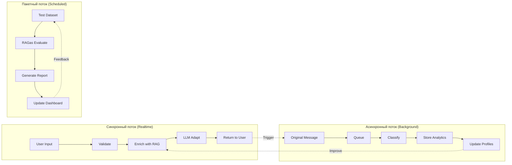
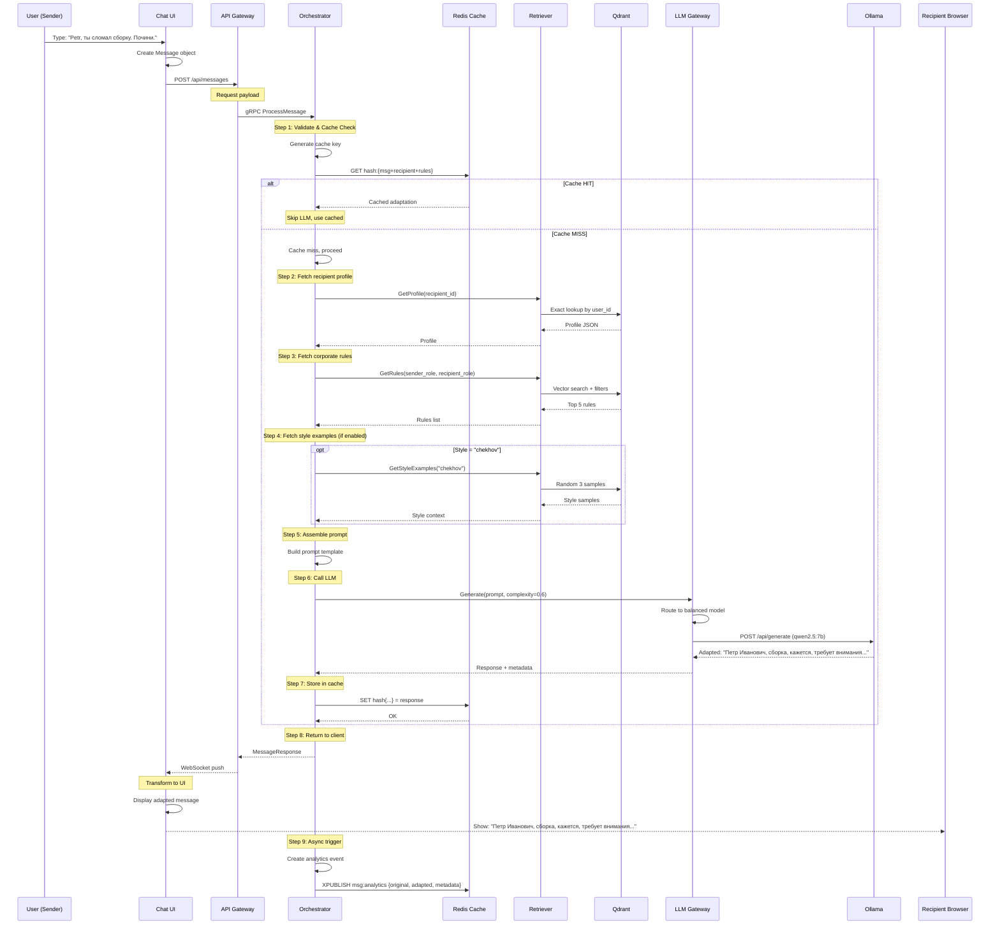
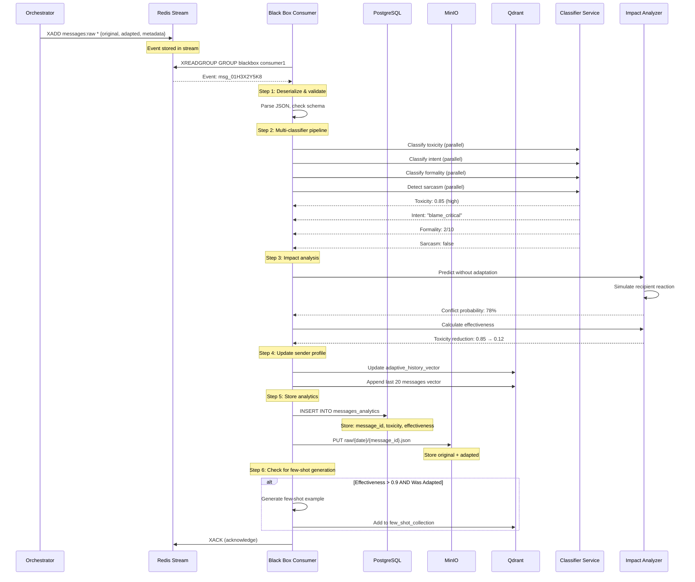
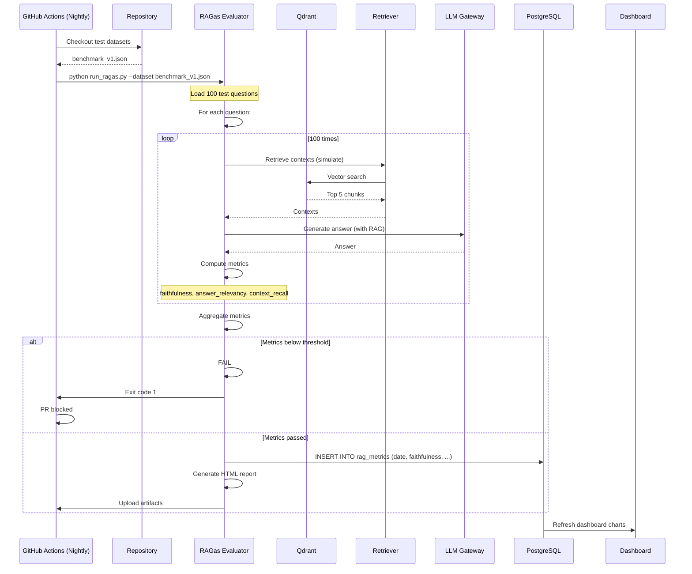
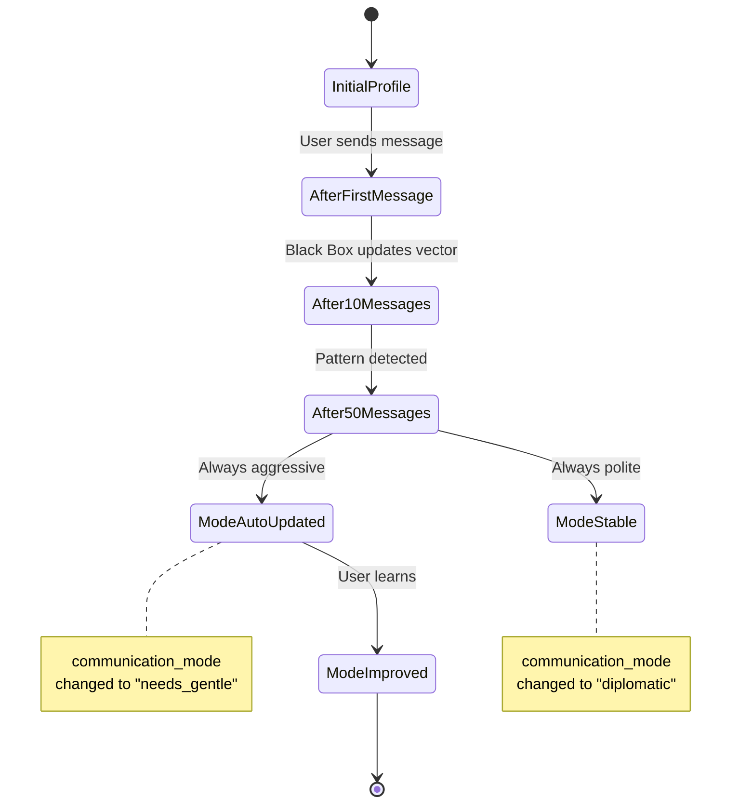
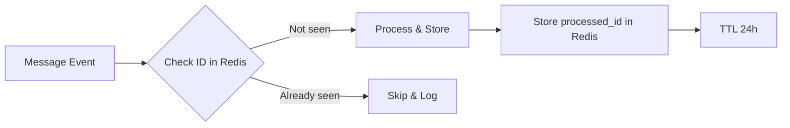
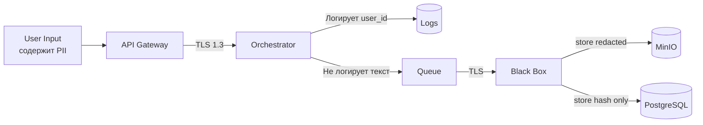

# Data Flow Documentation — Chameleon Chat

## Адаптивная коммуникационная система в реальном времени

---

## 1. Overview (Обзор потоков данных)

### 1.1. Три основных потока данных



### 1.2. Потоки данных по типам

| Тип данных | Источник | Назначение | Транспорт | Частота |
|------------|----------|------------|-----------|---------|
| **Сообщение (оригинал)** | Пользователь | Black Box | Redis Stream | Каждое сообщение |
| **Сообщение (адаптированное)** | LLM Gateway | Пользователь | WebSocket | Каждое сообщение |
| **Профили пользователей** | Admin UI / HR | Qdrant | HTTP/gRPC | При изменении |
| **Корпоративные правила** | Admin UI (файлы) | Qdrant | gRPC | Ручная загрузка |
| **Литературные стили** | Admin UI (книги) | Qdrant | gRPC | Ручная загрузка |
| **Метрики LLM** | LLM Gateway | Langfuse (local) | HTTP | Каждый вызов |
| **Трассировки** | Все сервисы | Langfuse (local) | HTTP | Каждый запрос |
| **Аналитика (сырая)** | Black Box | PostgreSQL | SQL | Каждое сообщение |
| **Аналитика (агрегаты)** | PostgreSQL | Dashboard | SQL | Каждый запрос |
| **Тестовые датасеты** | CI Pipeline | RAGas Evaluator | File | При каждом PR |

---

## 2. Synchronous Flow (Синхронный поток) — Realtime Adaptation

### 2.1. Полная диаграмма последовательности с данными



### 2.2. Структуры данных в синхронном потоке

#### 2.2.1. Входящее сообщение (от браузера)

```json
{
  "message_id": "msg_01H3X2Y5K8",
  "sender_id": "user_alex_ivanov",
  "recipient_id": "user_petr_smirnov",
  "room_id": "room_engineering_2024",
  "text": "Petr, ты сломал сборку. Почини.",
  "style": "chekhov",
  "timestamp": "2024-01-15T10:30:00Z"
}
```

#### 2.2.2. Профиль получателя (из Qdrant)

```json
{
  "user_id": "user_petr_smirnov",
  "full_name": "Смирнов Петр Иванович",
  "role": "team_lead",
  "department": "backend_platform",
  "honorific_type": "patronymic",
  "communication_mode": "formal",
  "known_triggers": ["deadline", "blame", "urgent"],
  "adaptive_history_vector": [0.123, -0.456]
}
```

#### 2.2.3. Корпоративные правила (из Qdrant)

```json
[
  {
    "rule_id": "rule_001",
    "category": "address",
    "priority": 10,
    "condition": "recipient_role IN ['director', 'team_lead']",
    "transformation": "replace 'ты' with 'вы', add patronymic",
    "example_original": "Петя, ты...",
    "example_adapted": "Петр Иванович, вы..."
  },
  {
    "rule_id": "rule_042",
    "category": "tone",
    "priority": 8,
    "condition": "contains_blame == true",
    "transformation": "rephrase accusation as observation",
    "example_original": "ты сломал",
    "example_adapted": "возможно, есть проблема с"
  }
]
```

#### 2.2.4. Промпт для LLM (собранный Orchestrator)

```text
## Original message:
Petr, ты сломал сборку. Почини.

## Recipient profile:
- Name: Смирнов Петр Иванович
- Role: team_lead
- Communication mode: formal
- Honorific: patronymic

## Corporate rules to apply:
1. Use 'вы' and patronymic for team leads
2. Avoid direct blame, rephrase as observation

## Style examples (Chekhov):
Example 1: "Дорогой мой, всё это так грустно..."
Example 2: "Кажется, жизнь прошла, а ничего не сделано..."

## Task:
Rewrite the message following the rules and style.
Preserve the original intent (something needs fixing).
Output ONLY the rewritten message, no explanations.
```

#### 2.2.5. Ответ LLM (адаптированный текст)

```json
{
  "adapted_text": "Петр Иванович, вы не находите, что сборка сегодня дышит как-то тяжело? Кажется, ей немного нездоровится. Не посмотрите?",
  "was_adapted": true,
  "confidence": 0.92,
  "model_used": "qwen2.5:7b",
  "tokens_used": {
    "prompt": 450,
    "completion": 28
  },
  "processing_time_ms": 487
}
```

---

## 3. Asynchronous Flow (Асинхронный поток) — Black Box Analytics

### 3.1. Диаграмма последовательности Black Box



### 3.2. Структуры данных в асинхронном потоке

#### 3.2.1. Событие в очереди (Redis Stream)

```json
{
  "event_id": "evt_01H3X2Y5K8_001",
  "event_type": "message_processed",
  "timestamp": "2024-01-15T10:30:01.234Z",
  "correlation_id": "c8f3a9b2-4d5e-4a1b-9c3d-7e8f2a1b4c5d",
  
  "original_message": {
    "message_id": "msg_01H3X2Y5K8",
    "sender_id": "user_alex_ivanov",
    "recipient_id": "user_petr_smirnov",
    "text": "Petr, ты сломал сборку. Почини.",
    "timestamp": "2024-01-15T10:30:00Z"
  },
  
  "adapted_message": {
    "text": "Петр Иванович, вы не находите, что сборка сегодня дышит как-то тяжело?",
    "was_adapted": true,
    "model_used": "qwen2.5:7b",
    "processing_time_ms": 487
  },
  
  "metadata": {
    "rules_applied": ["rule_001", "rule_042"],
    "style_used": "chekhov",
    "cache_hit": false,
    "fallback_used": false
  }
}
```

#### 3.2.2. Результат классификации

```json
{
  "message_id": "msg_01H3X2Y5K8",
  "classification": {
    "toxicity": {
      "score": 0.85,
      "label": "high",
      "subcategories": {
        "insult": 0.6,
        "threat": 0.1,
        "blame": 0.9
      }
    },
    "intent": {
      "primary": "blame_critical",
      "secondary": ["request_action", "negative_feedback"],
      "confidence": 0.94
    },
    "formality": {
      "score": 2,
      "scale": "1-10",
      "indicators": ["ты_usage", "imperative_mood", "missing_patronymic"]
    },
    "sarcasm": {
      "is_sarcastic": false,
      "confidence": 0.92
    },
    "emotion": {
      "anger": 0.7,
      "frustration": 0.6,
      "urgency": 0.8
    }
  }
}
```

#### 3.2.3. Анализ воздействия (Impact Analysis)

```json
{
  "message_id": "msg_01H3X2Y5K8",
  "without_adaptation": {
    "predicted_recipient_reaction": "negative_defensive",
    "conflict_probability": 0.78,
    "escalation_risk": "high",
    "likely_response": "Почему сразу я? Смотри сам."
  },
  "with_adaptation": {
    "predicted_recipient_reaction": "neutral_cooperative",
    "conflict_probability": 0.12,
    "escalation_risk": "low",
    "likely_response": "Давайте посмотрим вместе"
  },
  "effectiveness_metrics": {
    "toxicity_reduction": 0.86,
    "formality_increase": 6,
    "conflict_reduction": 0.85,
    "overall_score": 0.92
  }
}
```

#### 3.2.4. Хранение в PostgreSQL

```sql
-- Таблица messages_analytics
INSERT INTO messages_analytics (
    message_id,
    sender_id,
    recipient_id,
    original_text_hash,
    original_toxicity,
    original_intent,
    original_formality,
    adaptation_effectiveness,
    conflict_probability_without,
    conflict_probability_with,
    model_used,
    processing_latency_ms,
    was_adapted,
    created_at
) VALUES (
    'msg_01H3X2Y5K8',
    'user_alex_ivanov',
    'user_petr_smirnov',
    'sha256:7f83b1657ff1fc53b92dc18148a1d65d...',
    0.85,
    'blame_critical',
    2,
    0.92,
    0.78,
    0.12,
    'qwen2.5:7b',
    487,
    true,
    NOW()
);
```

#### 3.2.5. Архив в MinIO (сырые данные)

```
bucket: chameleon-raw-messages
path: /2024/01/15/msg_01H3X2Y5K8.json

Content:
{
  "original": "Petr, ты сломал сборку. Почини.",
  "adapted": "Петр Иванович, вы не находите, что сборка сегодня дышит как-то тяжело?",
  "classifications": { ... },
  "impact_analysis": { ... }
}
```

---

## 4. Batch Flow (Пакетный поток) — RAGas Evaluation & Reports

### 4.1. Диаграмма последовательности RAGas evaluation



### 4.2. Формат тестового датасета (benchmark_v1.json)

```json
{
  "dataset_name": "corporate_rules_benchmark",
  "version": "1.0",
  "created_at": "2024-01-15",
  "questions": [
    {
      "id": "q001",
      "question": "Как обратиться к директору в письме?",
      "ground_truth": "По имени-отчеству и на 'Вы', например: 'Александр Сергеевич, прошу...'",
      "contexts_expected": ["rule_address_director", "example_formal_email"],
      "category": "address",
      "difficulty": "easy"
    },
    {
      "id": "q002", 
      "question": "Можно ли критиковать код коллеги в общем чате?",
      "ground_truth": "Не рекомендуется. Лучше в личном сообщении, начиная с позитива.",
      "contexts_expected": ["rule_critique_private", "tone_guidelines"],
      "category": "tone",
      "difficulty": "medium"
    }
  ]
}
```

### 4.3. Метрики RAGas (результат оценки)

```json
{
  "run_id": "ragas_20240115_023000",
  "timestamp": "2024-01-15T02:30:00Z",
  "dataset_size": 100,
  "metrics": {
    "faithfulness": {
      "score": 0.82,
      "threshold": 0.75,
      "status": "PASS"
    },
    "answer_relevancy": {
      "score": 0.79,
      "threshold": 0.70,
      "status": "PASS"
    },
    "context_recall": {
      "score": 0.73,
      "threshold": 0.70,
      "status": "PASS"
    },
    "context_precision": {
      "score": 0.68,
      "threshold": 0.65,
      "status": "PASS"
    }
  },
  "by_category": {
    "address": {"faithfulness": 0.91, "answer_relevancy": 0.88},
    "tone": {"faithfulness": 0.76, "answer_relevancy": 0.72},
    "content": {"faithfulness": 0.79, "answer_relevancy": 0.77}
  },
  "failed_questions": [
    {
      "id": "q042",
      "question": "Как попросить дедлайн?",
      "faithfulness": 0.45,
      "reason": "LLM придумала несуществующее правило 'можно требовать дедлайн утром'"
    }
  ]
}
```

### 4.4. HTML отчет (генерация)

```html
<!-- rag_report_20240115.html -->
<div class="summary">
  <h2>RAGas Evaluation Report - 2024-01-15</h2>
  <div class="metrics-grid">
    <div class="metric green">Faithfulness: 0.82 ✓</div>
    <div class="metric green">Answer Relevancy: 0.79 ✓</div>
    <div class="metric green">Context Recall: 0.73 ✓</div>
  </div>
  <div class="failed-list">
    <h3>Failed Questions (1/100)</h3>
    <pre>Q042: "Как попросить дедлайн?" - Faithfulness 0.45</pre>
  </div>
</div>
```

---

## 5. Data Transformations (Трансформации данных)

### 5.1. Трансформация сообщения через пайплайн

```mermaid
flowchart LR
    subgraph Input
        I1[Original Text<br/>"Petr, ты сломал сборку"]
    end
    
    subgraph Transform1["Шаг 1: Rule-based"]
        T1a[Detect: 'ты' → requires formal]
        T1b[Detect: 'сломал' → blame keyword]
    end
    
    subgraph Transform2["Шаг 2: RAG enrichment"]
        T2a[Profile: team_lead, patronymic]
        T2b[Rules: rule_001, rule_042]
        T2c[Style: Chekhov examples]
    end
    
    subgraph Transform3["Шаг 3: LLM rewrite"]
        T3[Prompt → Model → Response]
    end
    
    subgraph Transform4["Шаг 4: Validation"]
        T4a[Check: intent preserved?]
        T4b[Check: toxicity reduced?]
    end
    
    subgraph Output
        O1[Adapted Text<br/>"Петр Иванович, сборка требует внимания..."]
    end
    
    I1 --> Transform1 --> Transform2 --> Transform3 --> Transform4 --> O1
```

### 5.2. Трансформация профиля пользователя (эволюция)



### 5.3. SQL трансформации (агрегации для дашборда)

```sql
-- Ежечасная агрегация
CREATE OR REPLACE FUNCTION aggregate_hourly_metrics()
RETURNS void AS $$
BEGIN
    INSERT INTO hourly_metrics (hour, total_messages, avg_toxicity, avg_effectiveness)
    SELECT 
        DATE_TRUNC('hour', created_at) as hour,
        COUNT(*) as total_messages,
        AVG(original_toxicity) as avg_toxicity,
        AVG(adaptation_effectiveness) as avg_effectiveness
    FROM messages_analytics
    WHERE created_at > NOW() - INTERVAL '1 hour'
    GROUP BY hour;
END;
$$ LANGUAGE plpgsql;

-- Топ-10 триггеров (фраз, вызывающих адаптацию)
SELECT 
    trigger_phrase,
    COUNT(*) as frequency,
    AVG(adaptation_effectiveness) as avg_effectiveness
FROM (
    SELECT 
        UNNEST(extracted_triggers) as trigger_phrase,
        adaptation_effectiveness
    FROM messages_analytics
    WHERE was_adapted = true
) t
GROUP BY trigger_phrase
ORDER BY frequency DESC
LIMIT 10;
```

---

## 6. Data Volume and Throughput (Объёмы данных)

### 6.1. Оценка нагрузки (для прототипа)

| Параметр | Значение | Примечание |
|----------|----------|------------|
| Пользователей | 50 | Для внутреннего прототипа |
| Сообщений в день | 5,000 | ~100 на пользователя |
| Пик сообщений/сек | 10 | В час пик |
| Средняя длина сообщения | 150 символов | ~40 токенов |
| Размер промпта (средний) | 2,500 токенов | С RAG контекстом |
| Токенов в день (LLM) | 12.5M | 5000 * 2500 токенов |
| Время на адаптацию (среднее) | 500 мс | - |

### 6.2. Объём хранимых данных (за месяц)

| Хранилище | Тип данных | Размер в день | Размер за месяц |
|-----------|------------|---------------|-----------------|
| **Qdrant** | Векторы (профили, правила, стили) | 10 MB | 300 MB (мало изменений) |
| **Redis** | Кэш адаптаций | 50 MB | 1.5 GB (с ротацией) |
| **PostgreSQL** | Метаданные + аналитика | 25 MB | 750 MB |
| **MinIO** | Сырые оригиналы (JSON) | 150 MB (5K сообщений по 30KB) | 4.5 GB |
| **Логи (stdout)** | JSON логи всех сервисов | 200 MB | 6 GB |
| **Итого** | - | ~435 MB/день | ~13 GB/месяц |

### 6.3. Пропускная способность (throughput)

```yaml
Синхронный поток:
  max_throughput: 50 msg/sec (с кэшем)
  bottleneck: Ollama (max 10 concurrent)
  
Асинхронный поток:
  max_throughput: 100 msg/sec
  bottleneck: PostgreSQL writes
  
Batch поток:
  execution_time: ~15 минут (100 вопросов)
  frequency: 1 раз в день (nightly)
```

---

## 7. Data Consistency and Integrity (Согласованность)

### 7.1. Гарантии на потоках

| Поток | Уровень согласованности | Механизм |
|-------|------------------------|----------|
| Синхронный | **Eventual consistency** | Кэш может быть устаревшим до 1 часа |
| Асинхронный | **At-least-once delivery** | Redis Stream + consumer group с XACK |
| Batch | **Strong consistency** | Транзакции PostgreSQL |

### 7.2. Обработка дубликатов



### 7.3. Восстановление после сбоев

| Сценарий | Стратегия восстановления | RPO | RTO |
|----------|--------------------------|-----|-----|
| Redis cache loss | Repopulate from real requests | 0 (cache only) | 10 минут (auto) |
| PostgreSQL crash | Restore from WAL + daily backup | 5 минут | 15 минут |
| MinIO corruption | Re-upload from PostgreSQL (reverse) | 1 час | 1 час |
| Ollama model error | Fallback to API | 0 | 10 секунд |
| Queue message loss | No recovery (best effort) | Сообщение потеряно | - |

---

## 8. Data Flow Examples (Сквозные примеры)

### 8.1. Пример #1: Успешная адаптация с кэшем

```
10:30:00.000 [User] Вводит: "Сделайте отчет к пятнице"
10:30:00.100 [Gateway] POST request
10:30:00.150 [Orchestrator] Cache key: hash(msg+recipient)
10:30:00.160 [Redis] HIT! Возвращает кэш
10:30:00.170 [Gateway] WebSocket push: "Уважаемая Анна Сергеевна, прошу подготовить отчет до пятницы"
10:30:00.180 [Recipient] Видит адаптированное сообщение
10:30:00.190 [Orchestrator] Async push в очередь

Total latency: 190ms ✅
```

### 8.2. Пример #2: Полный цикл с анализом

```
10:35:00.000 [User] Вводит: "Иванов, ты опять всё сломал"
10:35:00.200 [Orchestrator] Cache MISS
10:35:00.300 [Retriever] Profile: Иванов Иван (senior, informal allowed)
10:35:00.400 [Retriever] Rules: avoid blame, use first_name
10:35:00.800 [LLM] Адаптирует: "Иван, кажется, возникла проблема с последними изменениями"
10:35:00.900 [User] Отправлено
10:35:00.950 [Recipient] Видит адаптированное

--- Асинхронный поток ---
10:35:01.000 [Queue] Получено событие
10:35:02.500 [Black Box] Классификация: оригинал toxicity 0.92 (высокая)
10:35:03.000 [Black Box] Impact analysis: конфликт без адаптации 85%
10:35:03.500 [Black Box] Сохранено в PostgreSQL
10:35:04.000 [Black Box] Профиль отправителя обновлен (добавлен в историю)

Total async latency: 4 seconds (не влияет на пользователя)
```

### 8.3. Пример #3: Fallback при ошибке LLM

```
10:40:00.000 [User] Сообщение
10:40:00.200 [Orchestrator] Cache MISS
10:40:00.600 [Retriever] Контекст собран
10:40:00.700 [LLM Gateway] Вызов Ollama (mixtral)
10:40:01.200 [Ollama] TIMEOUT (нет ответа за 500ms)
10:40:01.300 [LLM Gateway] RETRY #1
10:40:01.800 [Ollama] TIMEOUT #2
10:40:01.900 [LLM Gateway] FALLBACK → OpenAI API
10:40:02.500 [OpenAI] Адаптированный текст
10:40:02.600 [User] Отправлено с задержкой

User видит индикатор: ⚠️ Использован резервный сервис
Итоговая латентность: 2.6 сек (но сообщение доставлено)
```

---

## 9. Security Data Flows (Безопасность данных)

### 9.1. Классификация данных по чувствительности

| Тип данных | Уровень | Обезличивание | Где хранится |
|------------|---------|---------------|--------------|
| Оригинал сообщения | **Confidential** | Локально, не логируется | MinIO (шифровано) |
| Адаптированное сообщение | **Internal** | Можно логировать | Транзит, Redis cache |
| Профиль пользователя (ПДн) | **Confidential** | user_id в логах, ФИО в Qdrant | Qdrant + PostgreSQL |
| Аналитика (агрегаты) | **Public** | Полностью обезличено | PostgreSQL (открыто) |
| Корпоративные правила | **Internal** | Не содержит ПДн | Qdrant |
| Трассировки Langfuse | **Confidential** | Обрезаются PII | Langfuse cloud |

### 9.2. Потоки с PII (персональные данные)



---

## 10. Appendix: Data Schemas (Схемы данных)

### 10.1. Полная схема события (Avro)

```avro
{
  "type": "record",
  "name": "MessageEvent",
  "namespace": "chameleon.analytics",
  "fields": [
    {"name": "event_id", "type": "string"},
    {"name": "event_type", "type": "string"},
    {"name": "timestamp", "type": "long", "logicalType": "timestamp-millis"},
    {"name": "correlation_id", "type": "string"},
    {"name": "original_message", "type": {
      "type": "record",
      "name": "OriginalMessage",
      "fields": [
        {"name": "message_id", "type": "string"},
        {"name": "sender_id", "type": "string"},
        {"name": "recipient_id", "type": "string"},
        {"name": "text", "type": "string"},
        {"name": "timestamp", "type": "long"}
      ]
    }},
    {"name": "adapted_message", "type": {
      "type": "record",
      "name": "AdaptedMessage",
      "fields": [
        {"name": "text", "type": "string"},