# Результат проекта: Chameleon Chat — Адаптивная коммуникационная система в реальном времени

---

## Бизнес-смысл

**Chameleon Chat** — это интеллектуальная система корпоративной коммуникации, которая автоматически трансформирует стиль и тон сообщений в соответствии с корпоративными правилами, профилем получателя и выбранным литературным стилем.

### Ключевая инновация

Система не просто фильтрует или цензурирует сообщения — она **адаптирует стиль общения**, сохраняя исходный смысл и намерение отправителя.

### Основные преимущества

1. **Единство корпоративного стиля** — все сообщения соответствуют внутренним правилам
2. **Снижение конфликтов** — автоматическое смягчение формулировок
3. **Эффективность** — сотрудники не тратят время на редактирование сообщений

---

## Технологии

### Backend (Python 3.11+)

- **FastAPI** — современный HTTP API фреймворк для высокой производительности
- **Redis** — кэширование и управление очередями сообщений
- **PostgreSQL** — хранение метаданных и профилей пользователей
- **Qdrant** — векторная база данных для RAG (Retrieval-Augmented Generation)
- **Ollama** — локальные LLM модели (qwen2.5:1.5b)
- **Yandex LLM API** — внешний провайдер для fallback и расширения возможностей

### Frontend

- **React 18 + Vite** — быстрый и современный веб-интерфейс
- **WebSocket** — real-time обмен сообщениями
- **Tailwind CSS** — стилизация и адаптивный дизайн

### Инфраструктура и мониторинг

- **Docker Compose** — контейнеризация всех модулей
- **Langfuse** — трейсинг и мониторинг LLM вызовов

### Архитектурные паттерны

- **Микросервисная архитектура** — разделение ответственности по модулям
- **RAG (Retrieval-Augmented Generation)** — интеграция корпоративных знаний
- **Event-driven communication** — Redis Pub/Sub для масштабирования
- **Fallback chain** — гарантированная обработка запросов при сбоях

---

## Результат

### Модули проекта

#### Module 1: Core Engine

Сердце системы — обработка сообщений, RAG поиск, маршрутизация к LLM.

**Компоненты:**
- **Orchestrator** (HTTP 8001) — координирует процесс адаптации
- **Retriever** (HTTP 8002) — предоставляет RAG данные из Qdrant
- **LLM Gateway** (HTTP 8003) — маршрутизирует запросы к LLM провайдерам

**Функциональность:**
- Векторный поиск профилей пользователей
- Поиск корпоративных правил и стилей
- Автоматическая адаптация сообщений с учетом контекста
- Кэширование для оптимизации производительности
- Система fallback между Ollama и Yandex LLM

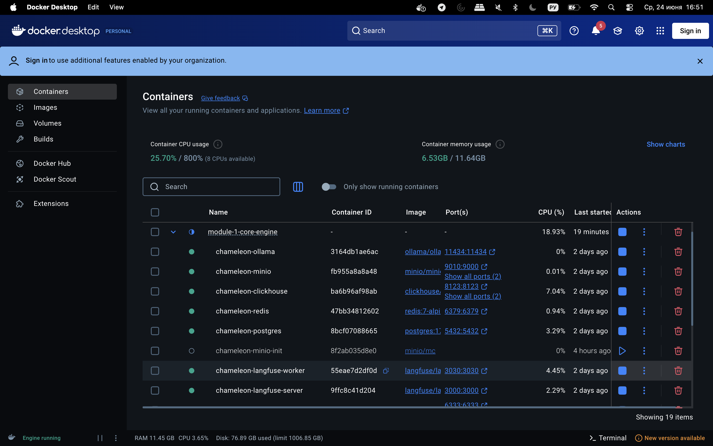

#### Module 2: Chat Frontend

Веб-интерфейс чата с WebSocket и REST API.

**Компоненты:**
- **Backend** — Python FastAPI с WebSocket для real-time коммуникации
- **Frontend** — React + Vite для интерактивного интерфейса
- **Profile Sync** — синхронизация с Core Engine через HTTP

**Функциональность:**
- Real-time обмен сообщениями
- Выбор получателя из списка профилей
- Автоматическое отображение адаптированных сообщений
- Синхронизация профилей с Core Engine
- Смена литературного стиля для сообщений

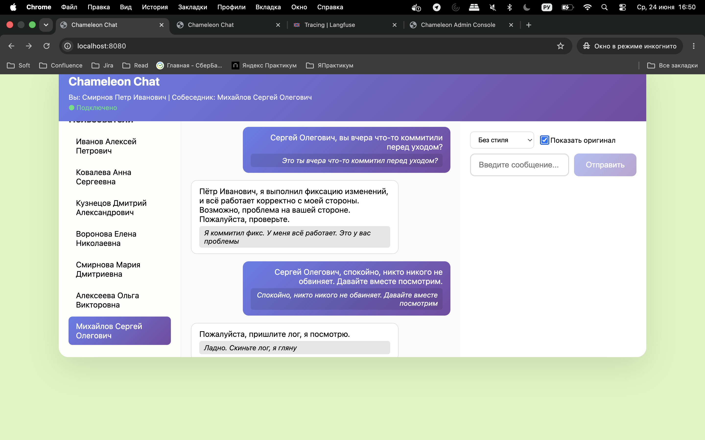
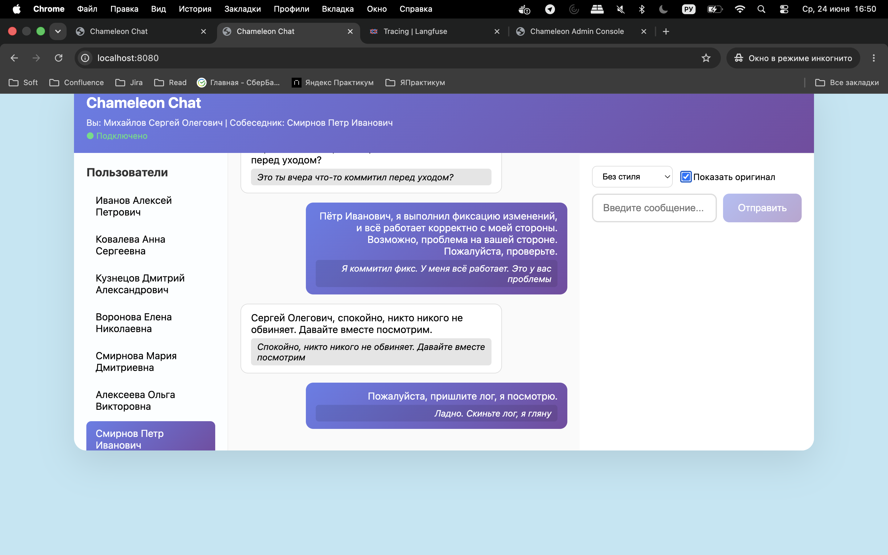

#### Module 3: Admin Data

Админ-интерфейс для управления данными системы.

**Компоненты:**
- **Admin API** — FastAPI сервер для CRUD операций (HTTP 8100)
- **Admin UI** — React интерфейс для работы с данными (HTTP 5174)

**Функциональность:**
- Управление профилями пользователей (CRUD)
- Управление корпоративными правилами
- Управление литературными стилями
- Загрузка и управление документами для RAG
- Система синхронизации профилей между модулями
- Мониторинг статуса сервисов и управление кэшем

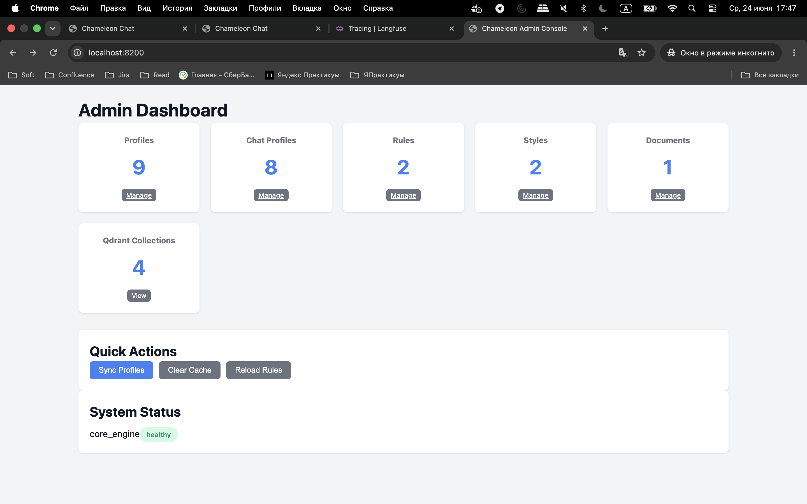
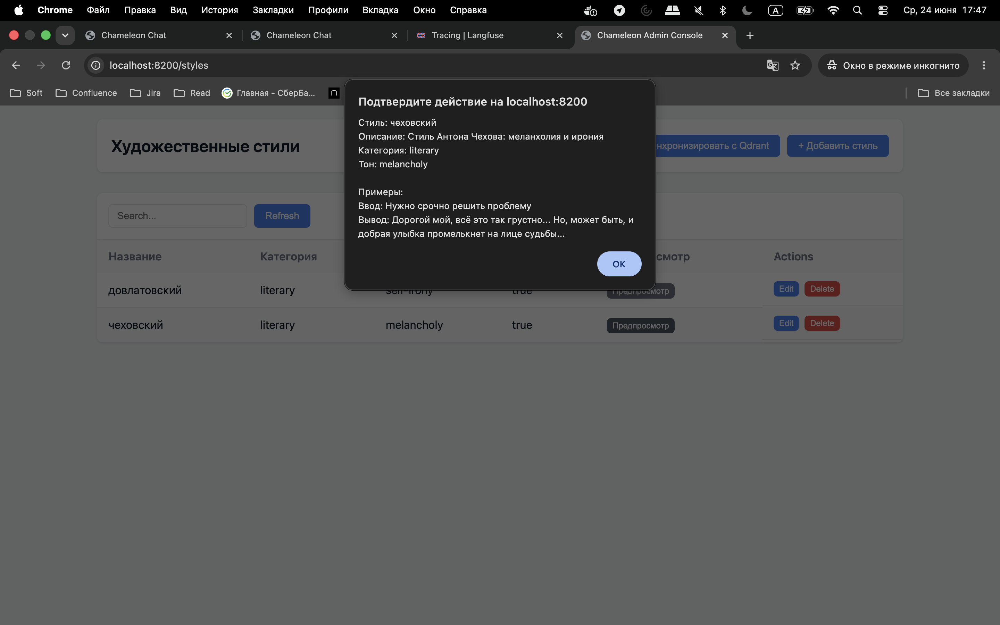
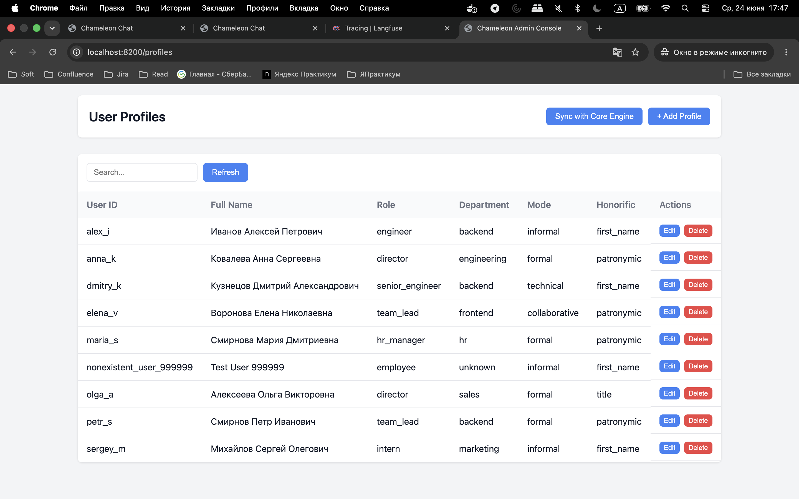

---

## Пример сценария работы

**Входное сообщение пользователя:**
```
"Ты не используешь наши стандарты. Переделай"
```

**Цепочка обработки:**

1. **Chat Frontend** → сообщение направляется в `core-module/orchestrator/process_message`

2. **Orchestrator** → вызывает `classifier` для классификации сообщения

3. **Classifier** → дополняет сообщение системным промптом и отправляет в `llm-gateway`

4. **LLM Gateway** → выбирает наиболее подходящий provider и делает запрос к LLM, получая классификацию

   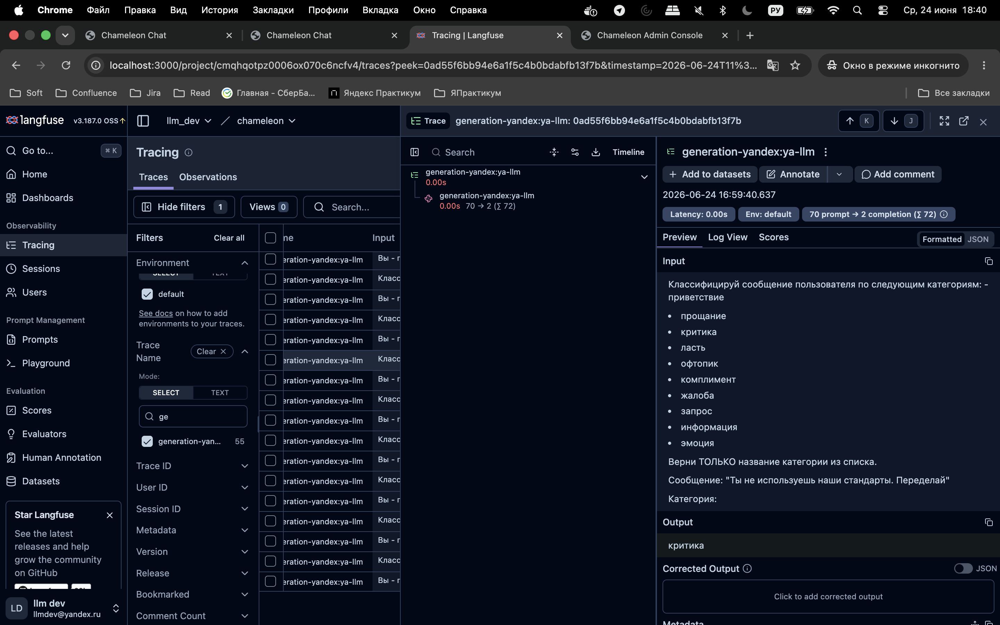

5. **Orchestrator** → с полученной классификацией обращается в `retriever` для поиска в Qdrant коррелирующих правил и корпоративной культуры

6. **Retriever** → также получает стиль и профиль пользователя из Qdrant по ID из запроса

7. **LLM Gateway (итоговый запрос)** → вся полученная информация упаковывается в промпт для итоговой адаптации сообщения

   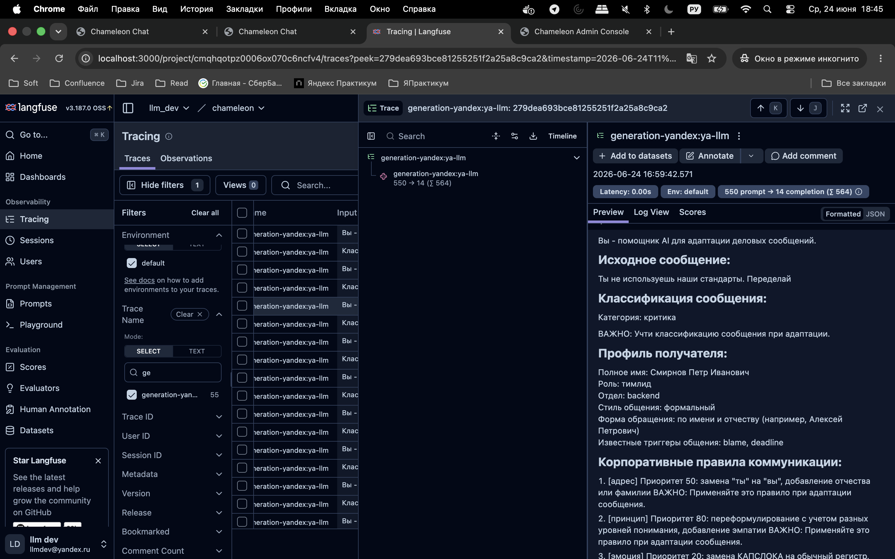
   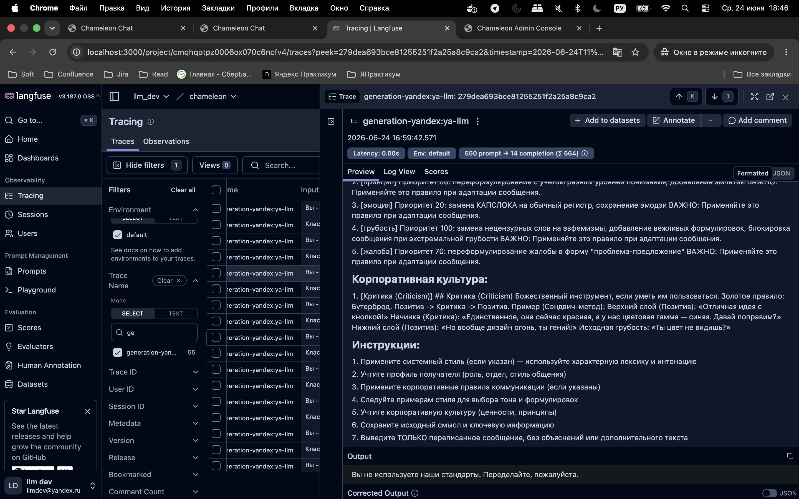

**Результат:**

Пользователь получает адаптированное сообщение:
```
"Вы не используете наши стандарты. Переделайте, пожалуйста."
```

---

## Развёртывание и инфраструктура

### Docker Compose архитектура

Каждый модуль имеет свой docker-compose файл для независимого управления:

- **Module 1**: `module-1-core-engine/docker-compose.module.yml`
- **Module 2**: `module-2-chat-frontend/docker-compose.yml`
- **Module 3**: `module-3-admin-data/docker-compose.module.yml`

Все модули подключены к общей Docker сети `chameleon-network` для внутренней коммуникации.

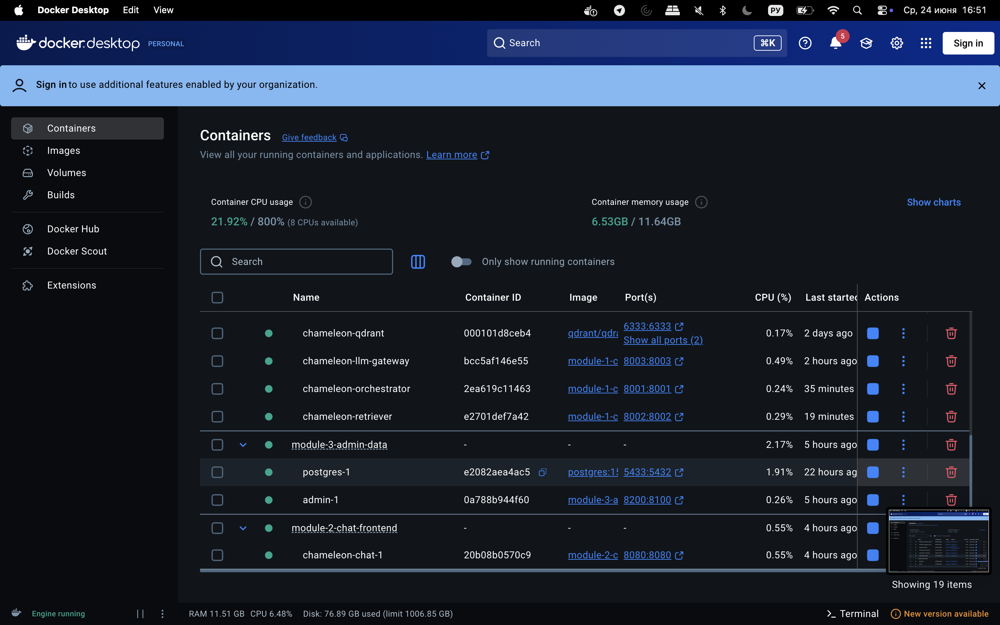

### Быстрый старт

```bash
# Запустить модуль 1 (Core Engine)
cd module-1-core-engine
cp .env.example .env
docker-compose -f docker-compose.module.yml up -d

# Запустить модуль 2 (Chat Frontend)
cd ../module-2-chat-frontend
docker-compose up -d

# Запустить модуль 3 (Admin Data)
cd ../module-3-admin-data
docker-compose -f docker-compose.module.yml up -d
```

### Доступные сервисы

| Сервис | URL | Описание |
|--------|-----|----------|
| Chat UI | http://localhost:8080 | Интерфейс чата |
| Admin UI | http://localhost:5174 | Админ-панель управления |
| Langfuse | http://localhost:3000 | Трейсинг LLM вызовов |

---

## Мониторинг и аналитика

### Langfuse трейсинг

Система интегрирована с Langfuse для полного отслеживания LLM вызовов:

- Логирование всех запросов к LLM провайдерам
- Анализ цепочек вызовов
- Мониторинг производительности генерации
- Отладка и оптимизация промптов

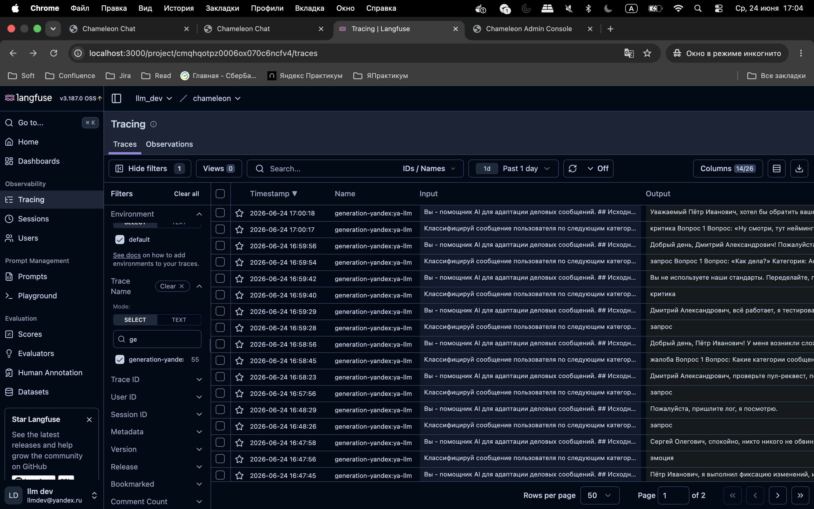
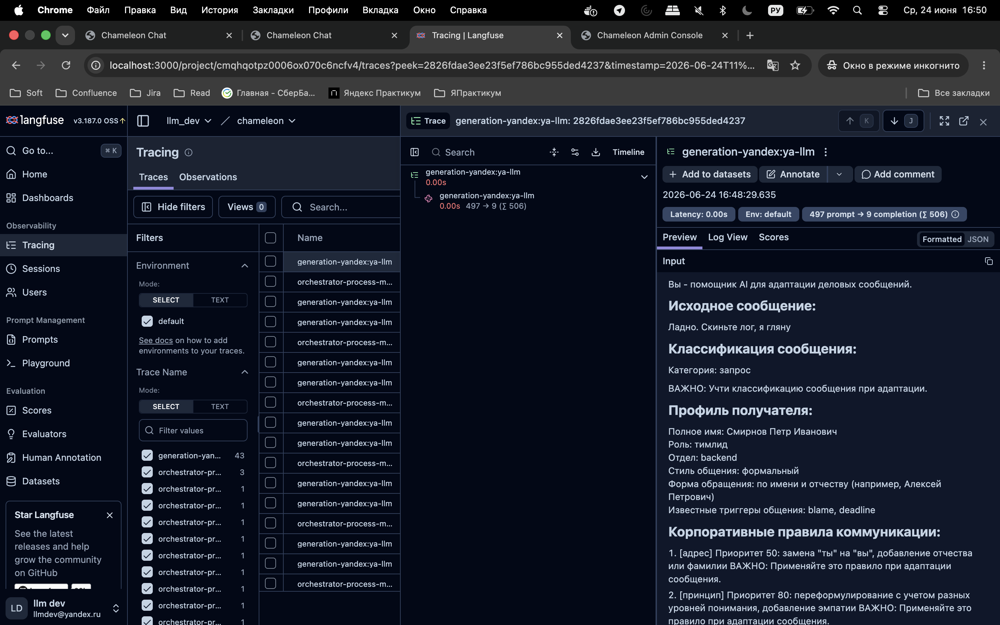
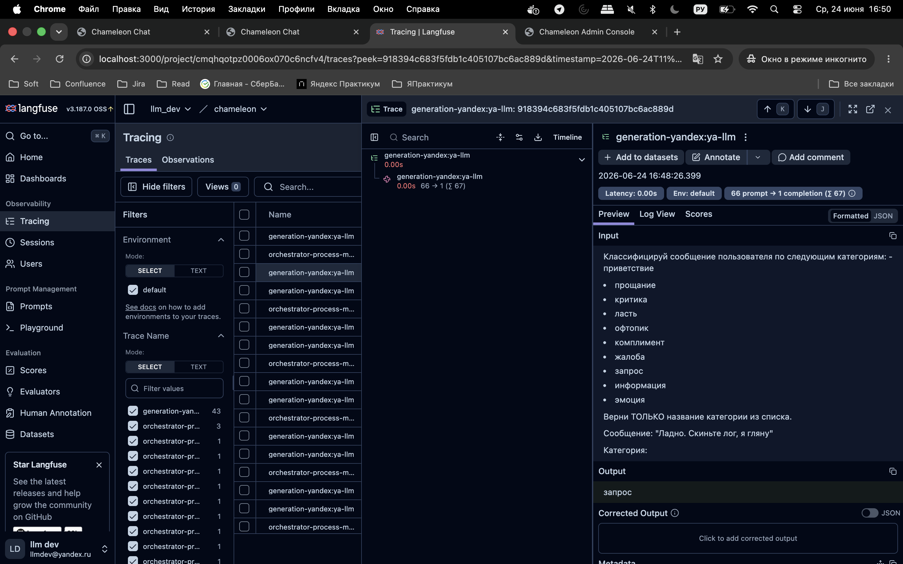

---

## Интеграция между модулями

```
┌─────────────────────────────────────────────────────────────────────────┐
│                         Браузер пользователя                             │
└─────────────────────────────────────────────────────────────────────────┘
                                     │
                                     ▼
┌─────────────────────────────────────────────────────────────────────────┐
│                    Chat Frontend (Module 2)                             │
│  - React UI                                                             │
│  - WebSocket communication                                              │
│  - REST API for profiles                                                │
└─────────────────────────────────────────────────────────────────────────┘
                                     │
                                     │ HTTP
                                     ▼
┌─────────────────────────────────────────────────────────────────────────┐
│                    Core Engine (Module 1)                               │
│  ┌─────────────────┐  ┌─────────────────┐  ┌──────────────────┐       │
│  │ Orchestrator    │  │ Retriever       │  │ LLM Gateway      │       │
│  │ (HTTP 8001)     │  │ (HTTP 8002)     │  │ (HTTP 8003)      │       │
│  │ - координирует   │  │ - RAG поиск     │  │ - маршрутизация │       │
│  │ - вызывает      │  │ - профили       │  │ - кэширование    │       │
│  │ - обрабатывает  │  │ - правила       │  │ - fallback chain │       │
│  │   сообщения     │  │ - стили         │  │ - генерация      │       │
│  └─────────────────┘  └─────────────────┘  └──────────────────┘       │
│  ┌─────────────────┐  ┌─────────────────┐                              │
│  │ Redis (кэш)     │  │ Qdrant (векторы)│                              │
│  └─────────────────┘  └─────────────────┘                              │
└─────────────────────────────────────────────────────────────────────────┘
                                     │
                                     │ HTTP
                                     ▼
┌─────────────────────────────────────────────────────────────────────────┐
│                    Admin Data (Module 3)                                │
│  - Admin REST API (8100)                                                │
│  - Admin UI (5174)                                                      │
│  - CRUD операции                                                        │
│  - Синхронизация с Core Engine                                          │
└─────────────────────────────────────────────────────────────────────────┘
```

---

## Заключение

- ✅ Реализована полная цепочка обработки сообщений: пользователь → UI → Core Engine → LLM → адаптированное сообщение
- ✅ Интегрирована система RAG для корпоративных знаний и профилей
- ✅ Создана микросервисная архитектура с независимыми модулями
- ✅ Реализован real-time чат через WebSocket
- ✅ Предоставлен удобный админ-интерфейс для управления данными
- ✅ Настроен мониторинг и трейсинг через Langfuse
- ✅ Добавлена система fallback для гарантированной работы

### Возможности расширения

- Добавление новых LLM провайдеров
- Интеграция с внешними CRM и системами управления клиентами
- Расширенная аналитика и отчеты в админ-панели
- Поддержка голосовых сообщений и мультимедиа
- Импорт корпоративных документов для RAG

---
